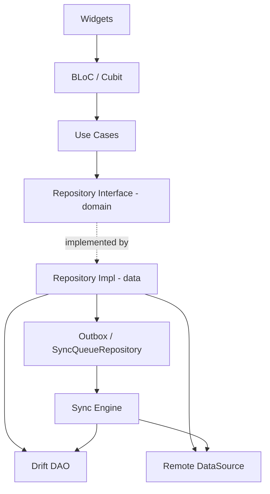

# CLAUDE.md

> Repo memory cho Claude Code. Đọc file này trước khi làm bất cứ việc gì trong repo.
> Nguồn gốc đầy đủ: `docs/blueprint.md`. File này là bản rút gọn **có tính ràng buộc** — khi mâu thuẫn, blueprint thắng về ý định, CLAUDE.md thắng về convention.

---

## 1. Project

**Finance App** — ứng dụng quản lý tài chính cá nhân **offline-first** viết bằng Flutter.

Mục tiêu **không phải** là "làm được app thu chi". Mục tiêu là chứng minh khả năng thiết kế và maintain một Flutter client có **data architecture phức tạp, chạy ổn định khi mạng không đáng tin cậy**.

Vì vậy khi phải chọn giữa:

| Ưu tiên cao | Ưu tiên thấp |
|---|---|
| Sync engine đúng | Thêm màn hình mới |
| Migration test | Animation đẹp |
| Idempotency | Multi-currency |
| Benchmark 50k rows | AI feature |
| ADR giải thích trade-off | Số lượng feature |

→ luôn chọn cột trái.

**Platform:** Android trước, iOS sau. Không support macOS/Web cho tới khi core ổn.

---

## 2. Golden rules (không được vi phạm)

1. **Local DB là source of truth cho UI.** UI đọc Drift stream, không bao giờ đọc network response trực tiếp.
2. **Tiền là `int` minor units.** Không `double`, không `num`, không ngoại lệ. Dùng value object `Money(minorUnits, currencyCode)`.
3. **Entity write + outbox mutation phải commit trong CÙNG một DB transaction.** Nếu tách ra, crash giữa chừng = data không bao giờ sync.
4. **ID do client generate (UUID v4/v7).** Không đợi server trả ID.
5. **Delete = soft delete** (`deleted_at`) cho mọi entity có sync. Hard delete chỉ dùng cho bảng nội bộ như `sync_mutations`.
6. **Không xoá mutation trước khi nhận response thành công.** Xoá sớm = mất data khi timeout.
7. **Không xoá database khi đổi schema.** Viết migration thật + migration test. (Ngoại lệ duy nhất: Phase 0–1, trước khi có seed data thật.)
8. **Presentation layer không được import** `dio`, `drift`, `supabase_flutter`, hoặc bất cứ DTO nào.
9. **Không log payload tài chính** (amount, note, email, token). Log id + entity type + error code thôi.
10. **Mọi quyết định kiến trúc → 1 ADR** trong `docs/adr/`. Không có ADR = quyết định chưa tồn tại.

---

## 3. Architecture

**Feature-first + Clean-Architecture-inspired + Offline-first Repository.**

Dependency direction (một chiều, không được ngược):

```
Presentation → Domain ← Data
                 ↑
              Core/Infra
```



### Layer contract

| Layer | Được chứa | Cấm chứa |
|---|---|---|
| `presentation` | Page, Widget, BLoC/Cubit, UI model | SQL, Dio, DTO, sync logic |
| `domain` | Entity, Value Object, Repository *interface*, UseCase, Failure | Bất cứ import Flutter nào (lý tưởng), DTO, Drift |
| `data` | Repository impl, DAO, DTO, Mapper, RemoteDataSource | Widget, BuildContext |
| `core` | Database, network client, sync coordinator, logger, secure storage, `Clock`, `UuidGenerator`, connectivity | Business rule của feature cụ thể |

### Quy tắc 3 model
`DTO` ≠ `Domain Entity` ≠ `DB Row`. Ba thứ khác nhau, có mapper riêng. Không dùng chung một class `Transaction` cho cả ba.

---

## 4. Folder structure

```
lib/
├── app/            # app.dart, bootstrap.dart, router/, theme/, di/
├── core/           # database/ network/ sync/ security/ error/ logging/ utils/ widgets/
├── features/
│   ├── auth/       # data/ domain/ presentation/
│   ├── accounts/
│   ├── transactions/
│   │   ├── data/          # datasources/ dto/ mapper/ repositories/
│   │   ├── domain/        # entities/ repositories/ usecases/
│   │   └── presentation/  # bloc/ pages/ widgets/
│   ├── categories/ budgets/ analytics/ receipts/ recurring/ settings/
└── main.dart

test/               # mirror lib/ structure
docs/
├── blueprint.md
├── system-design.md
├── adr/            # 0001-xxx.md
└── benchmarks/
```

**Cấm** layer-first (`lib/screens/`, `lib/services/`, `lib/models/`).

---

## 5. Tech stack (pin version, đừng auto-upgrade)

| Concern | Package | Version snapshot 2026-09-06 |
|---|---|---|
| Navigation | `go_router` | 18.0.1 |
| State | `flutter_bloc` | 9.1.1 |
| DI | `get_it` | 9.2.1 |
| Local DB | `drift` + `drift_flutter` | 2.34.x / 0.3.x |
| HTTP | `dio` | 5.11.1 |
| Backend | `supabase_flutter` | 2.17.2 |
| Immutable | `freezed`, `json_serializable` | — / 6.14.1 |
| Secure storage | `flutter_secure_storage` | — |
| Biometric | `local_auth` | 3.0.2 |
| Connectivity | `connectivity_plus` | 7.3.1 |
| Background | `workmanager` | — |
| Charts | `fl_chart` | 1.2.0 |
| OCR | `google_mlkit_text_recognition` | 0.17.1 |
| Crash | `sentry_flutter` | 9.29.0 |
| Test | `mocktail` 1.0.5, `bloc_test`, `patrol` | — |

**Drift note:** KHÔNG thêm `sqlite3_flutter_libs` theo tutorial cũ — đã EOL trong setup mới. Dùng `drift_flutter` native setup. Encryption dùng SQLite3MultipleCiphers build hook nếu cần.

**Trước khi thêm bất kỳ dependency mới nào**, phải trả lời được: (1) giải quyết vấn đề gì, (2) tự làm tốn bao nhiêu, (3) còn maintain không, (4) ảnh hưởng native setup không, (5) có lock-in architecture không. Nếu không trả lời được → không thêm.

---

## 6. Database rules

- Timestamps lưu `INTEGER` (epoch millis, UTC). Không lưu ISO string.
- Mọi entity sync được phải có: `id`, `owner_id`, `created_at`, `updated_at`, `version`, `deleted_at`.
- Index bắt buộc:
  - `transactions(owner_id, occurred_at DESC)`
  - `transactions(account_id, occurred_at DESC)`
  - `transactions(category_id, occurred_at DESC)`
  - `transactions(sync_status)`, `transactions(updated_at)`
  - `sync_mutations(status, next_attempt_at)`
- Balance **không lưu derived column** trừ khi có strategy recompute rõ ràng + test. Mặc định: tính bằng aggregate query có index.
- Query nặng chạy trên **background isolate** (Drift `driftDatabase(..., isolate)`).
- Không N+1 query. Dùng JOIN hoặc batch load.
- Mỗi lần đổi schema: bump `schemaVersion` + viết migration step + thêm fixture test.

---

## 7. Sync rules

Chu kỳ sync:

```
acquire lock → push pending mutations → pull delta (cursor) → apply trong DB transaction → persist cursor → release lock
```

- **Single-flight:** chỉ 1 sync chạy tại một thời điểm. Trigger trùng → trả về future đang chạy.
- **Sync reasons:** `appStarted`, `appResumed`, `manualRefresh`, `connectivityChanged`, `backgroundTask`, `mutationCreated`.
- **Idempotency key** gắn với mutation, không đổi qua các lần retry.
- **Retry:** exponential backoff + jitter. Retryable = network/timeout/5xx/429. Non-retryable = 4xx validation/auth (trừ 401 có refresh flow).
- **Conflict:** optimistic version. Client gửi `baseVersion`; server `UPDATE ... WHERE version = ?`; affected rows = 0 → conflict.
- **Cursor-based pull**, không dùng client wall-clock timestamp (clock skew).
- `connectivity_plus` chỉ là **signal**, không phải chân lý. Có connectivity ≠ có internet. Luôn để request thật quyết định.

---

## 8. Testing

| Loại | Bắt buộc cho |
|---|---|
| Unit | Money, domain validation, retry policy, conflict resolver |
| Repository | Mỗi repository impl, dùng in-memory Drift DB |
| DB | Aggregate query, index behaviour |
| Migration | **Mọi** schema version bump, có fixture DB cũ |
| Sync engine | offline→online, app-kill giữa sync, duplicate push, conflict, retry |
| BLoC | `bloc_test` cho state machine phức tạp |
| Widget | Loading/error/empty state |
| Integration | Golden path offline→sync→multi-device |

Test sync engine phải dùng **fake clock** và **fake remote**, không dùng `Future.delayed` thật.

---

## 9. Commands

```bash
# setup
flutter pub get
dart run build_runner build --delete-conflicting-outputs
dart run build_runner watch --delete-conflicting-outputs   # khi dev

# quality gate (chạy trước mỗi commit)
dart format --set-exit-if-changed .
flutter analyze
flutter test

# coverage
flutter test --coverage && genhtml coverage/lcov.info -o coverage/html

# drift schema (migration workflow)
dart run drift_dev schema dump lib/core/database/database.dart drift_schemas/
dart run drift_dev schema generate drift_schemas/ test/core/database/generated/

# benchmark
flutter test test/benchmark --dart-define=DATASET=50k

# run
flutter run --flavor dev --dart-define-from-file=env/dev.json
```

---

## 10. Git & PR

- Branch: `feat/<epic>-<slug>`, `fix/…`, `chore/…`, `docs/adr-…`
- Commit: Conventional Commits (`feat(sync): add durable outbox`)
- Mỗi PR phải có: **What / Why / Architecture impact / Screenshots / Testing / Risks**
- Squash merge vào `main`. `main` luôn xanh.
- CI gate: format → analyze → test → build.

---

## 11. Definition of Done

Feature chỉ Done khi đủ **tất cả**:

- [ ] Domain rule implemented + validate ở domain layer
- [ ] Local persistence implemented
- [ ] Sync behaviour đã được **quyết định và document** (kể cả khi quyết định là "không sync")
- [ ] Loading / error / empty state có UI
- [ ] Unit test cho logic quan trọng
- [ ] Migration nếu schema đổi + migration test
- [ ] Không có analyzer warning
- [ ] Docs/ADR cập nhật

---

## 12. Anti-patterns — reject ngay trong review

1. **API-driven UI**: widget gọi API rồi render response. → Phải đi qua local DB.
2. **Repository pass-through**: repo chỉ gọi thẳng datasource không thêm gì. → Repo phải sở hữu outbox + mapping + policy.
3. **DTO = Entity = Row** dùng chung 1 class.
4. **God BLoC**: một BLoC lo cả list, filter, form, sync, analytics.
5. **`bool isOnline`** làm điều kiện quyết định ghi local hay remote. → Luôn ghi local trước.
6. **Xoá sync mutation sau khi send request, trước khi nhận response.**
7. **Client timestamp làm absolute truth** cho ordering.
8. **Derived balance lưu cứng** không có recompute strategy.
9. **`double` cho tiền.**
10. **UI parse OCR raw text.** → Parser nằm ở domain/data.
11. **Over-engineering ngày 1**: 200 file interface trước khi có 1 use case chạy được.

---

## 13. Khi làm việc trong repo này, Claude nên

- **Hỏi trước khi thêm dependency mới** hoặc đổi architecture.
- Khi được yêu cầu implement feature: đọc phần tương ứng trong `docs/blueprint.md` trước, rồi mới code.
- Viết code theo thứ tự: domain entity → repository interface → DAO/drift table → repository impl → use case → BLoC → UI. Không nhảy thẳng vào UI.
- Luôn kèm test trong cùng PR, không "test sau".
- Khi đụng schema: nhắc bump `schemaVersion` + tạo migration + fixture test. Không tự ý xoá DB.
- Khi không chắc về trade-off: đề xuất 2 phương án + hệ quả, để người dùng chọn, rồi viết ADR.
- Giải thích ngắn gọn *why*, không giảng giải lại Flutter cơ bản.

---

## 14. Current status

> Cập nhật mỗi khi xong 1 phase. Xem chi tiết tuần ở `ROADMAP.md`.

| Field | Value |
|---|---|
| Phase hiện tại | **Phase 0 — Foundation** |
| Tuần | W1 |
| Drift schema version | — |
| Backend | chưa setup |
| ADR mới nhất | — |
| Blocker | — |
