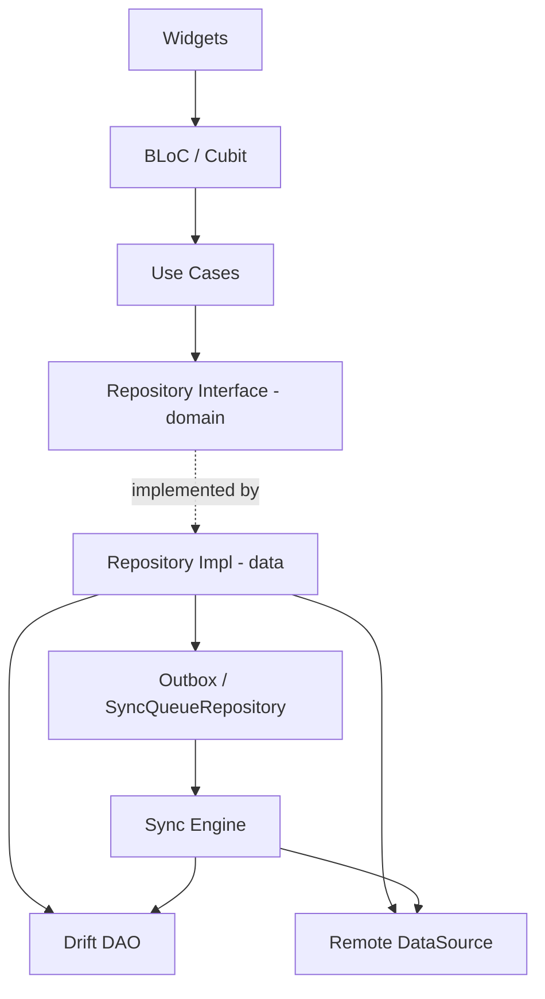

# CLAUDE.md

> Repo memory for Claude Code. Read this file before doing anything in this repo.
> Full source: `docs/blueprint.md`. This file is the condensed **binding** version — on conflict, the blueprint wins on intent, CLAUDE.md wins on convention.

---

## 1. Project

**Finance App** — an **offline-first** personal finance app written in Flutter.

The goal is **not** "ship a working expense tracker". The goal is to prove the ability to design and maintain a Flutter client with a **complex data architecture that stays reliable when the network cannot be trusted**.

So whenever there is a choice between:

| High priority                   | Low priority      |
| ------------------------------- | ----------------- |
| A correct sync engine           | One more screen   |
| Migration tests                 | Nice animations   |
| Idempotency                     | Multi-currency    |
| 50k-row benchmarks              | AI features       |
| An ADR explaining the trade-off | Raw feature count |

→ always take the left column.

**Platform:** Android first, iOS later. No macOS/Web support until the core is solid.

---

## 2. Golden rules (never violate)

1. **The local DB is the source of truth for the UI.** The UI reads Drift streams and never reads a network response directly.
2. **Money is `int` minor units.** No `double`, no `num`, no exceptions. Use the `Money(minorUnits, currencyCode)` value object.
3. **The entity write and the outbox mutation must commit in the SAME DB transaction.** Split them and a crash in between means data that never syncs.
4. **IDs are generated client-side (UUID v4/v7).** Never wait for the server to hand back an ID.
5. **Delete = soft delete** (`deleted_at`) for every synced entity. Hard delete is only for internal tables such as `sync_mutations`.
6. **Never delete a mutation before a successful response arrives.** Deleting early loses data on timeout.
7. **Never wipe the database on a schema change.** Write a real migration plus a migration test. (Only exception: Phase 0–1, before there is real seed data.)
8. **The presentation layer must not import** `dio`, `drift`, `supabase_flutter`, or any DTO.
9. **Never log financial payloads** (amount, note, email, token). Log id + entity type + error code only.
10. **Every architectural decision gets one ADR** in `docs/adr/`. No ADR means the decision does not exist yet.

---

## 3. Architecture

**Feature-first + Clean-Architecture-inspired + offline-first Repository.**

Dependency direction (one-way, never reversed):

```
Presentation → Domain ← Data
                 ↑
              Core/Infra
```



### Layer contract

| Layer          | May contain                                                                                                | Must not contain                         |
| -------------- | ---------------------------------------------------------------------------------------------------------- | ---------------------------------------- |
| `presentation` | Page, Widget, BLoC/Cubit, UI model                                                                         | SQL, Dio, DTO, sync logic                |
| `domain`       | Entity, Value Object, Repository _interface_, UseCase, Failure                                             | Any Flutter import (ideally), DTO, Drift |
| `data`         | Repository impl, DAO, DTO, Mapper, RemoteDataSource                                                        | Widget, BuildContext                     |
| `core`         | Database, network client, sync coordinator, logger, secure storage, `Clock`, `UuidGenerator`, connectivity | Business rules of any specific feature   |

### The three-model rule

`DTO` ≠ `Domain Entity` ≠ `DB Row`. Three distinct things, each with its own mapper. Never share one `Transaction` class across all three.

---

## 4. Folder structure

```
lib/
├── app/            # app.dart, bootstrap.dart, router/, theme/, di/
├── core/           # database/ network/ sync/ security/ error/ logging/ utils/ widgets/
├── features/
│   ├── auth/       # data/ domain/ presentation/
│   ├── accounts/
│   ├── transactions/
│   │   ├── data/          # datasources/ dto/ mapper/ repositories/
│   │   ├── domain/        # entities/ repositories/ usecases/
│   │   └── presentation/  # bloc/ pages/ widgets/
│   ├── categories/ budgets/ analytics/ receipts/ recurring/ settings/
└── main.dart

test/               # mirrors the lib/ structure
docs/
├── blueprint.md
├── system-design.md
├── adr/            # 0001-xxx.md
└── benchmarks/
```

Layer-first layouts (`lib/screens/`, `lib/services/`, `lib/models/`) are **forbidden**.

---

## 5. Tech stack (pinned versions, do not auto-upgrade)

| Concern        | Package                                 | Version snapshot 2026-09-06 |
| -------------- | --------------------------------------- | --------------------------- |
| Navigation     | `go_router`                             | 18.0.1                      |
| State          | `flutter_bloc`                          | 9.1.1                       |
| DI             | `get_it`                                | 9.2.1                       |
| Local DB       | `drift` + `drift_flutter`               | 2.34.x / 0.3.x              |
| HTTP           | `dio`                                   | 5.11.1                      |
| Backend        | `supabase_flutter`                      | 2.17.2                      |
| Immutable      | `freezed`, `json_serializable`          | — / 6.14.1                  |
| Secure storage | `flutter_secure_storage`                | —                           |
| Biometric      | `local_auth`                            | 3.0.2                       |
| Connectivity   | `connectivity_plus`                     | 7.3.1                       |
| Background     | `workmanager`                           | —                           |
| Charts         | `fl_chart`                              | 1.2.0                       |
| OCR            | `google_mlkit_text_recognition`         | 0.17.1                      |
| Crash          | `sentry_flutter`                        | 9.29.0                      |
| Test           | `mocktail` 1.0.5, `bloc_test`, `patrol` | —                           |

**Drift note:** do NOT add `sqlite3_flutter_libs` as older tutorials suggest — it is EOL in the current setup. Use the native `drift_flutter` setup. For encryption, use the SQLite3MultipleCiphers build hook if needed.

**Before adding any new dependency**, you must be able to answer: (1) what problem does it solve, (2) what would it cost to do it ourselves, (3) is it still maintained, (4) does it affect native setup, (5) does it lock in the architecture. If you cannot answer, do not add it.

---

## 6. Database rules

- Store timestamps as `INTEGER` (epoch millis, UTC). Never store ISO strings.
- Every synced entity must have: `id`, `owner_id`, `created_at`, `updated_at`, `version`, `deleted_at`.
- Required indexes:
  - `transactions(owner_id, occurred_at DESC)`
  - `transactions(account_id, occurred_at DESC)`
  - `transactions(category_id, occurred_at DESC)`
  - `transactions(sync_status)`, `transactions(updated_at)`
  - `sync_mutations(status, next_attempt_at)`
- Balances are **never stored as a derived column** unless there is an explicit recompute strategy plus tests. Default: compute with an indexed aggregate query.
- Heavy queries run on a **background isolate** (Drift `driftDatabase(..., isolate)`).
- No N+1 queries. Use a JOIN or batch loading.
- On every schema change: bump `schemaVersion`, write the migration step, add a fixture test.

---

## 7. Sync rules

The sync cycle:

```
acquire lock → push pending mutations → pull delta (cursor) → apply inside a DB transaction → persist cursor → release lock
```

- **Single-flight:** only one sync runs at a time. A duplicate trigger returns the in-flight future.
- **Sync reasons:** `appStarted`, `appResumed`, `manualRefresh`, `connectivityChanged`, `backgroundTask`, `mutationCreated`.
- **The idempotency key** belongs to the mutation and never changes across retries.
- **Retry:** exponential backoff + jitter. Retryable = network/timeout/5xx/429. Non-retryable = 4xx validation/auth (except 401, which has a refresh flow).
- **Conflict:** optimistic versioning. The client sends `baseVersion`; the server runs `UPDATE ... WHERE version = ?`; affected rows = 0 means conflict.
- **Cursor-based pull**, never a client wall-clock timestamp (clock skew).
- `connectivity_plus` is only a **signal**, not the truth. Having connectivity ≠ having internet. Always let the real request decide.

---

## 8. Testing

| Kind        | Required for                                                       |
| ----------- | ------------------------------------------------------------------ |
| Unit        | Money, domain validation, retry policy, conflict resolver          |
| Repository  | Every repository impl, using an in-memory Drift DB                 |
| DB          | Aggregate queries, index behaviour                                 |
| Migration   | **Every** schema version bump, with a fixture of the old DB        |
| Sync engine | offline→online, app kill mid-sync, duplicate push, conflict, retry |
| BLoC        | `bloc_test` for non-trivial state machines                         |
| Widget      | Loading/error/empty states                                         |
| Integration | Golden path offline→sync→multi-device                              |

Sync engine tests must use a **fake clock** and a **fake remote**, never a real `Future.delayed`.

---

## 9. Commands

```bash
# setup
flutter pub get
dart run build_runner build --delete-conflicting-outputs
dart run build_runner watch --delete-conflicting-outputs   # while developing

# quality gate (the pre-commit hook runs the first two; see .githooks/pre-commit)
fvm dart format --output=none --set-exit-if-changed .   # drop --output=none to rewrite files in place
fvm dart analyze --fatal-infos                          # without --fatal-infos the strict lint set does nothing
fvm flutter test

# enable the hook (once per clone; git does not enable it for you)
git config core.hooksPath .githooks

# coverage
flutter test --coverage && genhtml coverage/lcov.info -o coverage/html

# drift schema (migration workflow)
dart run drift_dev schema dump lib/core/database/database.dart drift_schemas/
dart run drift_dev schema generate drift_schemas/ test/core/database/generated/

# benchmark
flutter test test/benchmark --dart-define=DATASET=50k

# run
flutter run --flavor dev --dart-define-from-file=env/dev.json
```

---

## 10. Git & PR

### Branch model

| Branch      | Role                                                                                         | Receives                | Green        |
| ----------- | -------------------------------------------------------------------------------------------- | ----------------------- | ------------ |
| `main`      | Release. Tagged.                                                                             | PR from `dev` **only**  | always       |
| `dev`       | **Staging / integration.** AB-test and manual-QA builds are cut from here.                   | PR from any work branch | always       |
| work branch | The actual work. Naming: `task/W<n>`, `feat/<epic>-<slug>`, `fix/…`, `chore/…`, `docs/adr-…` | —                       | before merge |

- **Nothing is pushed directly to `dev` or `main`.** Always a PR, always green CI.
- A work branch never targets `main`. `main` only ever sees `dev`.
- **Never rebase or force-push `dev` or `main`.** Both are shared, and `dev` is the ref an
  AB-test build points at — rewriting it invalidates a build somebody is already testing.
- `dev` is staging, not a scratchpad: it must stay green, because a red `dev` means there is
  nothing to cut a test build from.

### Merge strategy

- work branch → `dev`: **merge commit** (`--no-ff`). The per-task commits are the deliverable
  (one week = T2/T3/T4, each a distinct decision); squashing them into `chore: week N` destroys
  exactly the history this repo exists to show.
- `dev` → `main`: **merge commit**, then tag the release. Same reason one level up — a squash
  here flattens a whole phase into one commit.
- Squash is the **exception**, only for a genuinely messy WIP branch (a dozen `fix typo`
  commits). Say so in the PR when you use it.

### Rules

- Commit: Conventional Commits (`feat(sync): add durable outbox`)
- Every PR must have: **What / Why / Architecture impact / Screenshots / Testing / Risks**
- CI gate: format → analyze → test → build. Runs on every PR into `main` / `dev` and on every
  push to them (`.github/workflows/ci.yml`).
- Branch protection required on **both** `main` and `dev`: require a PR, require the
  `format → analyze → test` check, no force push, no deletion.

---

## 11. Definition of Done

A feature is Done only when **all** of these hold:

- [ ] Domain rule implemented and validated in the domain layer
- [ ] Local persistence implemented
- [ ] Sync behaviour **decided and documented** (including when the decision is "does not sync")
- [ ] Loading / error / empty states have UI
- [ ] Unit tests for the logic that matters
- [ ] Migration written if the schema changed, plus a migration test
- [ ] Zero analyzer warnings
- [ ] Docs/ADR updated

---

## 12. Anti-patterns — reject on sight in review

1. **API-driven UI**: a widget calls the API and renders the response. → It must go through the local DB.
2. **Pass-through repository**: the repo just forwards to the datasource and adds nothing. → The repo must own the outbox, mapping, and policy.
3. **DTO = Entity = Row** sharing a single class.
4. **God BLoC**: one BLoC handling list, filter, form, sync, and analytics.
5. **`bool isOnline`** deciding whether to write locally or remotely. → Always write locally first.
6. **Deleting a sync mutation after sending the request but before the response arrives.**
7. **Client timestamps as absolute truth** for ordering.
8. **Hard-stored derived balances** with no recompute strategy.
9. **`double` for money.**
10. **The UI parsing raw OCR text.** → The parser belongs in domain/data.
11. **Day-one over-engineering**: 200 interface files before a single use case runs.

---

## 13. When working in this repo, Claude should

- **Ask before adding a new dependency** or changing the architecture.
- When asked to implement a feature: read the matching section of `docs/blueprint.md` first, then write code.
- Write code in this order: domain entity → repository interface → DAO/drift table → repository impl → use case → BLoC → UI. Never jump straight to the UI.
- Always include tests in the same PR. Never "tests later".
- When touching the schema: call out the `schemaVersion` bump, the migration, and the fixture test. Never wipe the DB unilaterally.
- When a trade-off is unclear: propose two options with their consequences, let the user choose, then write the ADR.
- Explain the _why_ briefly. Do not re-teach Flutter basics.

---

## 14. Current status

> Update whenever a phase completes. Week-by-week detail lives in `ROADMAP.md`.

| Field                | Value                                                                                  |
| -------------------- | -------------------------------------------------------------------------------------- |
| Current phase        | **Phase 0 — Foundation**                                                               |
| Week                 | W1 (T4 done: CI format → analyze → test; branch protection still manual)               |
| Lint baseline        | `very_good_analysis` 10.0.0, pinned file version, overrides in `analysis_options.yaml` |
| Line width           | 180 — `formatter.page_width` (CLI) + `dart.lineLength` (editor), the two must match    |
| Drift schema version | —                                                                                      |
| Backend              | not set up yet                                                                         |
| Latest ADR           | —                                                                                      |
| Blocker              | —                                                                                      |
