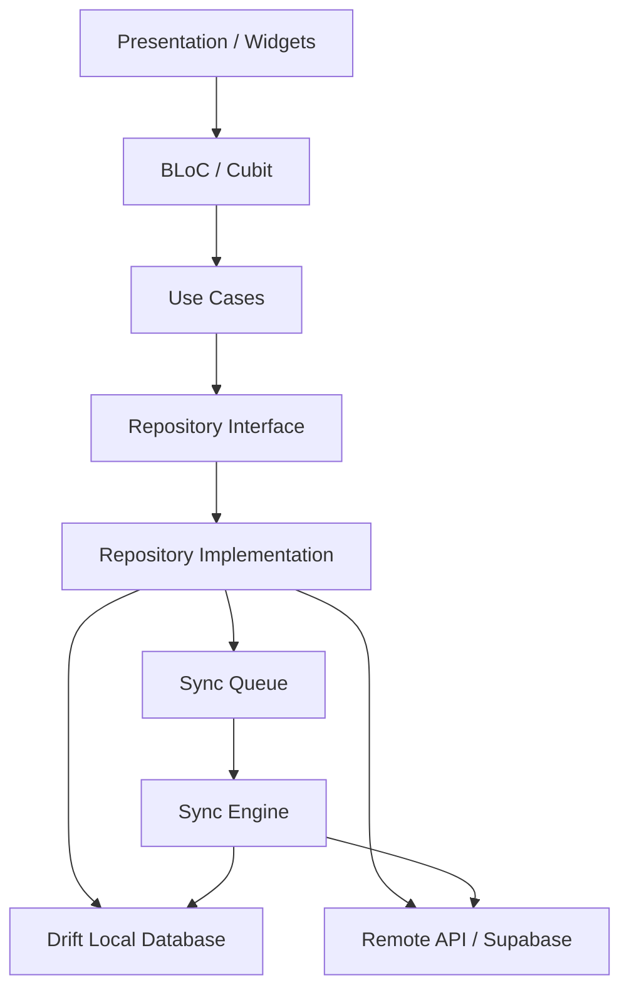

# Project Blueprint — Offline-first Personal Finance App (Flutter)

> **Mục tiêu:** xây dựng một ứng dụng quản lý tài chính cá nhân có chất lượng gần với production, tập trung vào **offline-first architecture, data consistency, synchronization, database performance, security, testing và maintainability** thay vì chỉ làm CRUD/UI.
>
> **Đối tượng phù hợp:** Flutter Developer khoảng strong junior → mid-level đang muốn tiến lên **strong mid / senior-track**.
>
> **Tài liệu snapshot:** 2026-09-06. Package/API có thể thay đổi theo thời gian; khi bắt đầu project nên pin phiên bản stable phù hợp với Flutter/Dart SDK đang dùng.

---

## Table of Contents

1. [Project summary](#1-project-summary)
2. [Tại sao project này đáng làm](#2-tại-sao-project-này-đáng-làm)
3. [Mục tiêu kỹ thuật](#3-mục-tiêu-kỹ-thuật)
4. [Non-goals](#4-non-goals)
5. [Product concept](#5-product-concept)
6. [User personas & use cases](#6-user-personas--use-cases)
7. [Feature scope](#7-feature-scope)
8. [Core user flows](#8-core-user-flows)
9. [Non-functional requirements](#9-non-functional-requirements)
10. [Architecture tổng thể](#10-architecture-tổng-thể)
11. [Architecture theo layer](#11-architecture-theo-layer)
12. [Feature-first project structure](#12-feature-first-project-structure)
13. [Tech stack & package matrix](#13-tech-stack--package-matrix)
14. [Dependency Injection](#14-dependency-injection)
15. [Navigation](#15-navigation)
16. [State management](#16-state-management)
17. [Domain modeling](#17-domain-modeling)
18. [Money modeling](#18-money-modeling)
19. [Local database](#19-local-database)
20. [Database schema](#20-database-schema)
21. [Database migrations](#21-database-migrations)
22. [Repository design](#22-repository-design)
23. [Offline-first strategy](#23-offline-first-strategy)
24. [Sync engine](#24-sync-engine)
25. [Mutation queue / Outbox pattern](#25-mutation-queue--outbox-pattern)
26. [Conflict resolution](#26-conflict-resolution)
27. [Soft delete / Tombstone](#27-soft-delete--tombstone)
28. [Retry strategy](#28-retry-strategy)
29. [Idempotency](#29-idempotency)
30. [Connectivity handling](#30-connectivity-handling)
31. [Backend recommendation](#31-backend-recommendation)
32. [API contract](#32-api-contract)
33. [Authentication](#33-authentication)
34. [Security](#34-security)
35. [Receipt scanner / OCR](#35-receipt-scanner--ocr)
36. [Recurring transactions](#36-recurring-transactions)
37. [Budget engine](#37-budget-engine)
38. [Analytics](#38-analytics)
39. [Search, filters & pagination](#39-search-filters--pagination)
40. [Background execution](#40-background-execution)
41. [Error handling](#41-error-handling)
42. [Logging & observability](#42-logging--observability)
43. [Performance](#43-performance)
44. [Testing strategy](#44-testing-strategy)
45. [CI/CD](#45-cicd)
46. [Environment & configuration](#46-environment--configuration)
47. [Accessibility, localization & UX](#47-accessibility-localization--ux)
48. [Git strategy](#48-git-strategy)
49. [Development roadmap](#49-development-roadmap)
50. [Definition of Done](#50-definition-of-done)
51. [Portfolio / CV completion criteria](#51-portfolio--cv-completion-criteria)
52. [README structure](#52-readme-structure)
53. [CV bullet examples](#53-cv-bullet-examples)
54. [Interview talking points](#54-interview-talking-points)
55. [Benchmark plan](#55-benchmark-plan)
56. [Stretch goals](#56-stretch-goals)
57. [Anti-patterns cần tránh](#57-anti-patterns-cần-tránh)
58. [Suggested package snapshot](#58-suggested-package-snapshot)
59. [Suggested first implementation order](#59-suggested-first-implementation-order)
60. [Final target](#60-final-target)
61. [References](#61-references)

---

# 1. Project summary

## Working title

Có thể đặt tên sau. Không quan trọng bằng engineering quality.

- Ledger
- Finora
- Pockit
- Moneta
- FinTrack
- FlowMoney

Trong tài liệu này gọi chung là **Finance App**.

## One-line pitch

> A production-oriented offline-first personal finance application built with Flutter, featuring local-first persistence, multi-device synchronization, secure storage, budgeting, receipt OCR, analytics and conflict-aware data synchronization.

## Project category

- Flutter Mobile Application
- Offline-first
- Personal Finance
- Data-heavy
- Multi-device sync
- Security-sensitive
- Local database
- Background processing

## Platforms

Ưu tiên:

1. Android
2. iOS

Optional sau khi core ổn:

3. macOS
4. Web

Không nên support mọi platform từ đầu vì sẽ làm scope phình ra mà không tăng nhiều giá trị engineering.

---

# 2. Tại sao project này đáng làm

Một app thu chi CRUD bình thường thường chỉ chứng minh:

- biết build UI;
- gọi API;
- dùng state management;
- lưu một ít local storage;
- navigation;
- form validation.

Những kỹ năng này chưa đủ tạo khác biệt ở level mid.

Project này nên chứng minh thêm:

- thiết kế architecture lớn;
- xử lý data consistency;
- local database thực tế;
- schema migration;
- offline-first;
- sync queue;
- retry/backoff;
- optimistic UI;
- conflict resolution;
- background task;
- authentication lifecycle;
- encryption;
- performance với dataset lớn;
- testing nhiều layer;
- observability;
- CI;
- release discipline.

Mục tiêu cuối cùng không phải:

> “Tôi làm được app quản lý chi tiêu.”

Mà là:

> “Tôi có thể thiết kế và maintain một Flutter client có data architecture phức tạp, hoạt động ổn định khi mạng không đáng tin cậy.”

---

# 3. Mục tiêu kỹ thuật

Sau khi hoàn thành project, bạn nên có thể tự giải thích rõ:

### Architecture

- Vì sao chọn feature-first architecture?
- Vì sao repository trả domain entity thay vì DTO?
- Vì sao UI đọc local DB thay vì gọi API trực tiếp?
- Khi nào dùng BLoC, khi nào Cubit?
- Dependency direction chạy theo hướng nào?

### Database

- Schema được thiết kế ra sao?
- Quan hệ giữa account, transaction và category?
- Index nào cần?
- Migration hoạt động thế nào?
- Vì sao tiền không dùng `double`?

### Offline-first

- User tạo transaction khi offline thì chuyện gì xảy ra?
- Khi mạng quay lại thì dữ liệu được push thế nào?
- Nếu app bị kill giữa sync thì sao?
- Nếu request gửi thành công nhưng app timeout trước khi nhận response thì sao?
- Làm thế nào tránh duplicate transaction?
- Delete được sync ra sao?

### Consistency

- Device A và B edit cùng một record thì sao?
- Last-write-wins có nhược điểm gì?
- Khi nào cần version number?
- Conflict cần hiển thị cho user khi nào?

### Performance

- 10,000–50,000 transactions có lag không?
- Query dashboard có scan toàn table không?
- List dùng pagination/cursor thế nào?
- Database query có chạy trên UI isolate không?

### Testing

- Repository test ra sao?
- Sync engine test ra sao?
- Migration test ra sao?
- Integration test offline → online thế nào?

---

# 4. Non-goals

Không nên biến project thành ngân hàng thật.

Không cần:

- kết nối tài khoản ngân hàng thật;
- Open Banking;
- payment processing;
- chuyển tiền thật;
- PCI DSS;
- KYC;
- chứng khoán;
- crypto wallet;
- accounting double-entry hoàn chỉnh ngay từ đầu;
- AI chatbot chỉ để “có AI”;
- 30 màn hình UI nhưng architecture nông.

Ưu tiên engineering depth hơn feature count.

---

# 5. Product concept

Finance App giúp user:

- quản lý nhiều tài khoản;
- ghi nhận income/expense;
- chuyển tiền giữa tài khoản;
- phân loại giao dịch;
- theo dõi budget;
- xem analytics;
- scan receipt;
- sử dụng hoàn toàn khi offline;
- đồng bộ giữa nhiều thiết bị khi online trở lại.

---

# 6. User personas & use cases

## Persona A — Daily expense tracker

Muốn:

- nhập giao dịch nhanh;
- dùng ngay cả khi mất mạng;
- xem tháng này tiêu bao nhiêu;
- biết category nào tiêu nhiều nhất.

## Persona B — Multi-account user

Có:

- cash;
- bank account;
- e-wallet;
- credit card.

Muốn biết:

- balance từng account;
- tổng tài sản;
- dòng tiền giữa các account.

## Persona C — Multi-device user

Dùng:

- Android phone;
- iPhone/tablet.

Muốn:

- dữ liệu được đồng bộ;
- không bị duplicate;
- edit trên device A được thấy trên device B.

---

# 7. Feature scope

## 7.1 MVP — bắt buộc

### Authentication

- Email/password
- Sign up
- Sign in
- Sign out
- Session restore

### Accounts

- Create account
- Edit account
- Archive account
- Account types:
  - Cash
  - Bank
  - E-wallet
  - Credit card
  - Other
- Current balance

### Transactions

- Expense
- Income
- Transfer
- Create
- Edit
- Delete
- Transaction detail
- Category
- Note
- Transaction date
- Account
- Amount

### Categories

- Default categories
- Custom category
- Income/expense type
- Icon
- Optional color token

### Local database

- Full local persistence
- Reactive queries
- Schema migrations

### Offline

- Full transaction CRUD offline
- Pending sync indicator
- Automatic retry

### Synchronization

- Push local mutations
- Pull remote changes
- Deduplication
- Soft delete
- Sync cursor
- Basic conflict resolution

### Dashboard

- Total balance
- Monthly income
- Monthly expense
- Recent transactions

---

## 7.2 V1 — nên có trước khi đưa CV

### Budget

- Budget by category
- Monthly budget
- Used percentage
- Remaining amount
- Warning threshold

### Analytics

- Spending by category
- Income vs expense
- Cashflow trend
- Monthly comparison

### Search/filter

- Search note
- Filter category
- Filter account
- Date range
- Transaction type

### Receipt attachment

- Add receipt image
- Compress image
- Local cache
- Remote storage upload

### Security

- Secure session storage
- Biometric unlock
- Sensitive logging policy

### Production readiness

- Crash reporting
- Structured logging
- CI
- Unit tests
- Widget tests
- Integration tests

---

## 7.3 V2 — differentiation features

### Receipt OCR

Detect:

- merchant;
- total;
- date;
- candidate line items.

### Recurring transactions

Examples:

- rent;
- salary;
- Netflix;
- electricity;
- mobile plan.

### Multi-device conflict

- record version;
- conflict detection;
- conflict metadata.

### Export

- CSV
- JSON backup

### Import

- CSV import
- duplicate detection

---

## 7.4 Stretch

- Shared household wallet
- Multi-currency
- Exchange rate snapshots
- Savings goals
- Financial calendar
- Rule-based auto categorization
- App shortcuts
- Home-screen widget
- Siri/App Intents / Android shortcuts
- PDF monthly report

---

# 8. Core user flows

## Create expense while online

```text
UI
 ↓
TransactionBloc
 ↓
CreateTransactionUseCase
 ↓
TransactionRepository
 ↓
Local Database
 ↓
UI updates immediately
 ↓
Mutation inserted into Sync Queue
 ↓
Sync Engine
 ↓
Remote API
 ↓
Server accepts
 ↓
Local metadata updated to synced
```

UI không cần chờ network request.

---

## Create expense while offline

```text
Create Transaction
 ↓
Write local DB
 ↓
sync_state = pending
 ↓
Update UI immediately
 ↓
Outbox mutation created
 ↓
No network
 ↓
Keep mutation pending
 ↓
Network/app lifecycle triggers sync
 ↓
Push mutation
 ↓
Mark mutation completed
```

---

## Open app

```text
App Launch
 ↓
Initialize secure storage
 ↓
Initialize local database
 ↓
Restore auth session
 ↓
Render local data immediately
 ↓
Start sync coordinator
 ↓
Pull remote delta
 ↓
Apply remote changes to local DB
 ↓
Reactive Drift stream refreshes UI
```

Không cần spinner chờ toàn bộ backend mới render dashboard.

---

# 9. Non-functional requirements

## Reliability

- Không mất local mutation khi app bị kill.
- Sync có thể retry.
- Một mutation không được tạo duplicate remote record.
- Database migration không được làm mất data.

## Performance

Target tham khảo:

- App cold start: hợp lý trên mid-range Android.
- Transaction list 10k+ records vẫn responsive.
- 50k local records không gây crash.
- Scroll target 60fps.
- Dashboard aggregate query không scan dư thừa.
- DB work nặng không chạy trên UI isolate.

## Security

- Token không lưu plain text.
- Không log token/password.
- Receipt URL private.
- Backend enforce authorization.
- Local DB có option encryption.

## Maintainability

- Feature độc lập tương đối.
- Không import presentation layer từ data layer.
- Business logic test được mà không cần Flutter UI.

## Testability

- Domain use case pure Dart khi có thể.
- Repository dependency inject được.
- Sync transport mock được.
- Clock injectable để test recurring transaction.

---

# 10. Architecture tổng thể

Khuyến nghị:

> **Feature-first + Clean Architecture-inspired + Offline-first Repository**

Không cần Clean Architecture “giáo điều” với hàng trăm file interface vô nghĩa.

Mục tiêu là dependency rõ ràng.



---

# 11. Architecture theo layer

## Presentation

Chứa:

- Screen
- Widget
- BLoC / Cubit
- UI model nếu cần
- Router bindings

Không chứa:

- SQL;
- Dio;
- raw Supabase calls;
- DTO mapping;
- sync logic.

---

## Domain

Chứa:

- Entity
- Value Object
- Repository contract
- Use case
- Domain validation
- Domain failure

Ví dụ:

```text
Transaction
Account
Category
Budget
Money
Currency
TransactionType
SyncStatus
```

Domain layer lý tưởng không phụ thuộc Flutter.

---

## Data

Chứa:

- Repository implementation
- Local datasource
- Remote datasource
- DTO
- Mapper
- DAO
- Sync data model

---

## Infrastructure/Core

Chứa:

- Database setup
- Network client
- Auth session
- Logger
- Secure storage
- Clock
- UUID generator
- Connectivity
- Sync coordinator

---

# 12. Feature-first project structure

```text
lib/
├── app/
│   ├── app.dart
│   ├── bootstrap.dart
│   ├── router/
│   ├── theme/
│   └── di/
│
├── core/
│   ├── database/
│   ├── network/
│   ├── sync/
│   ├── security/
│   ├── error/
│   ├── logging/
│   ├── extensions/
│   ├── utils/
│   └── widgets/
│
├── features/
│   ├── auth/
│   │   ├── data/
│   │   ├── domain/
│   │   └── presentation/
│   │
│   ├── accounts/
│   │   ├── data/
│   │   ├── domain/
│   │   └── presentation/
│   │
│   ├── transactions/
│   │   ├── data/
│   │   │   ├── datasources/
│   │   │   ├── dto/
│   │   │   ├── mapper/
│   │   │   └── repositories/
│   │   ├── domain/
│   │   │   ├── entities/
│   │   │   ├── repositories/
│   │   │   └── usecases/
│   │   └── presentation/
│   │       ├── bloc/
│   │       ├── pages/
│   │       └── widgets/
│   │
│   ├── categories/
│   ├── budgets/
│   ├── analytics/
│   ├── receipts/
│   ├── recurring/
│   └── settings/
│
└── main.dart
```

### Không nên

```text
lib/
├── screens/
├── models/
├── services/
├── widgets/
└── utils/
```

cho project lớn, vì sau này mọi domain bị trộn vào nhau.

---

# 13. Tech stack & package matrix

> Không bắt buộc phải dùng đúng 100%. Mục đích là chọn stack có lý do rõ ràng.

| Concern | Recommendation | Vai trò |
|---|---|---|
| Navigation | `go_router` | Declarative navigation, deep link, guards |
| State management | `flutter_bloc` | BLoC/Cubit |
| DI | `get_it` | Dependency registration |
| Immutable model | `freezed` | Immutable class / union |
| JSON | `json_serializable` | DTO serialization |
| HTTP | `dio` | API client, interceptor, cancellation |
| Local DB | `drift` | Reactive SQLite, migration, type safety |
| Flutter DB setup | `drift_flutter` | Native Flutter database setup |
| Backend | `supabase_flutter` | Auth/Postgres/Storage; hoặc custom backend |
| Secure key-value | `flutter_secure_storage` | Token / encryption key material |
| Biometrics | `local_auth` | Biometric/local auth |
| Connectivity signal | `connectivity_plus` | Connectivity change signal |
| Background task | `workmanager` | Background sync trigger |
| Charts | `fl_chart` | Analytics charts |
| Receipt image | `image_picker` | Camera/gallery |
| OCR | `google_mlkit_text_recognition` | On-device OCR |
| Crash reporting | `sentry_flutter` | Error/performance observability |
| Test mocks | `mocktail` | Mock dependencies |
| BLoC test | `bloc_test` | BLoC state testing |
| E2E/native | `patrol` | Integration/native UI automation |
| Localization | Flutter `gen_l10n` | Typed localization |
| Date/number | `intl` | Formatting |
| UUID | `uuid` | Client generated IDs |

### Package philosophy

Không dùng package chỉ vì “tiện”.

Mỗi dependency nên trả lời được:

1. Nó giải quyết vấn đề gì?
2. Nếu tự làm thì cost bao nhiêu?
3. Package còn maintain không?
4. Có ảnh hưởng platform/native setup không?
5. Có lock-in architecture không?
6. Có cần nó ở core layer hay feature layer?

---

# 14. Dependency Injection

Khuyến nghị:

```text
get_it
```

Registration tách theo module.

```text
configureCoreDependencies()
configureAuthDependencies()
configureAccountDependencies()
configureTransactionDependencies()
configureSyncDependencies()
```

Ví dụ dependency graph:

```text
TransactionBloc
      ↓
CreateTransactionUseCase
      ↓
TransactionRepository
      ↓
TransactionRepositoryImpl
      ↓
├─ TransactionDao
├─ TransactionRemoteDataSource
└─ SyncQueueRepository
```

### Rule

Presentation không gọi:

```dart
getIt<Dio>().post(...)
```

Thay vào đó:

```dart
context.read<TransactionBloc>().add(...)
```

---

# 15. Navigation

Recommendation:

```text
go_router
```

Route proposal:

```text
/
├── /auth
│   ├── /login
│   └── /register
│
├── /home
│
├── /accounts
│   ├── /new
│   └── /:accountId
│
├── /transactions
│   ├── /new
│   └── /:transactionId
│
├── /budgets
├── /analytics
└── /settings
```

Use:

- typed routes nếu phù hợp;
- auth redirect;
- ShellRoute cho bottom navigation;
- deep link tới transaction detail.

Ví dụ:

```text
financeapp://transactions/123
```

---

# 16. State management

Recommendation:

```text
flutter_bloc
```

## Cubit phù hợp

- theme;
- selected period;
- simple form state;
- filter state;
- biometric toggle.

## BLoC phù hợp

- transaction lifecycle;
- complex search;
- sync dashboard;
- authentication;
- multi-event state machine.

### Ví dụ TransactionBloc

Events:

```text
TransactionStarted
TransactionCreated
TransactionUpdated
TransactionDeleted
TransactionFilterChanged
TransactionLoadMoreRequested
```

State:

```text
initial
loading
ready
failure
```

Hoặc một immutable state:

```dart
class TransactionState {
  final List<Transaction> items;
  final bool isLoading;
  final bool isLoadingMore;
  final TransactionFilter filter;
  final Failure? failure;
}
```

Không cần tạo state class mới cho từng thay đổi nếu nó làm logic khó theo dõi.

---

# 17. Domain modeling

Entity chính:

```text
User
Account
Transaction
Category
Budget
Receipt
RecurringRule
SyncMutation
```

## Transaction

```text
Transaction
├── id
├── ownerId
├── type
├── accountId
├── destinationAccountId?
├── categoryId?
├── amount
├── currency
├── occurredAt
├── note?
├── receiptId?
├── createdAt
├── updatedAt
├── version
├── deletedAt?
└── syncStatus
```

### Transaction types

```dart
enum TransactionType {
  income,
  expense,
  transfer,
}
```

### Transfer

Không model transfer thành:

```text
expense + income
```

mà không có relation.

Có thể chọn:

### Option A

Một transaction có:

```text
sourceAccountId
destinationAccountId
```

### Option B

Double-entry-inspired:

```text
Transfer
├── debit entry
└── credit entry
```

Option A đủ cho V1.

Option B là stretch goal nếu muốn học accounting model.

---

# 18. Money modeling

## Tuyệt đối tránh

```dart
double amount = 10.1;
```

Vì floating point có thể gây sai số.

### Preferred

Lưu **minor unit dưới dạng integer**.

Ví dụ USD:

```text
$10.25
→ 1025 cents
```

VND hiện không dùng đơn vị thập phân trong thực tế:

```text
125000 VND
→ 125000
```

Value object:

```dart
class Money {
  final int minorUnits;
  final String currencyCode;
}
```

Các operation:

```text
add
subtract
compare
format
```

Rule:

```text
Không cộng Money khác currency nếu chưa convert.
```

---

# 19. Local database

Recommendation:

```text
Drift + SQLite
```

Lý do:

- typed query;
- reactive stream;
- transaction;
- migration;
- joins;
- indexes;
- aggregate query;
- testable;
- phù hợp relational financial data.

UI nên subscribe local query.

Ví dụ:

```text
watchMonthlyTransactions()
watchAccountBalances()
watchBudgetSummary()
```

Remote update sau khi sync được write local DB, Drift stream tự emit data mới.

---

# 20. Database schema

## users

```text
id TEXT PRIMARY KEY
email TEXT
created_at INTEGER
updated_at INTEGER
```

---

## accounts

```text
id TEXT PRIMARY KEY
owner_id TEXT NOT NULL
name TEXT NOT NULL
type TEXT NOT NULL
currency_code TEXT NOT NULL
initial_balance INTEGER NOT NULL
is_archived INTEGER NOT NULL
created_at INTEGER NOT NULL
updated_at INTEGER NOT NULL
version INTEGER NOT NULL
deleted_at INTEGER NULL
```

Indexes:

```text
(owner_id)
(owner_id, is_archived)
```

---

## categories

```text
id TEXT PRIMARY KEY
owner_id TEXT NULL
name TEXT NOT NULL
type TEXT NOT NULL
icon_key TEXT
color_key TEXT
is_system INTEGER NOT NULL
created_at INTEGER
updated_at INTEGER
version INTEGER
deleted_at INTEGER NULL
```

---

## transactions

```text
id TEXT PRIMARY KEY
owner_id TEXT NOT NULL
type TEXT NOT NULL
account_id TEXT NOT NULL
destination_account_id TEXT NULL
category_id TEXT NULL
amount_minor INTEGER NOT NULL
currency_code TEXT NOT NULL
occurred_at INTEGER NOT NULL
note TEXT NULL
receipt_id TEXT NULL
created_at INTEGER NOT NULL
updated_at INTEGER NOT NULL
version INTEGER NOT NULL
deleted_at INTEGER NULL
sync_status TEXT NOT NULL
```

Important indexes:

```text
(owner_id, occurred_at DESC)
(account_id, occurred_at DESC)
(category_id, occurred_at DESC)
(sync_status)
(updated_at)
```

---

## budgets

```text
id TEXT PRIMARY KEY
owner_id TEXT NOT NULL
category_id TEXT NOT NULL
period_type TEXT NOT NULL
limit_minor INTEGER NOT NULL
currency_code TEXT NOT NULL
start_at INTEGER NOT NULL
end_at INTEGER NOT NULL
warning_percent INTEGER
created_at INTEGER
updated_at INTEGER
version INTEGER
deleted_at INTEGER NULL
```

---

## receipts

```text
id TEXT PRIMARY KEY
owner_id TEXT NOT NULL
local_path TEXT NULL
remote_path TEXT NULL
upload_status TEXT NOT NULL
ocr_status TEXT NOT NULL
ocr_raw_text TEXT NULL
merchant TEXT NULL
total_minor INTEGER NULL
currency_code TEXT NULL
purchased_at INTEGER NULL
created_at INTEGER
updated_at INTEGER
```

---

## recurring_rules

```text
id TEXT PRIMARY KEY
owner_id TEXT NOT NULL
transaction_template_json TEXT NOT NULL
frequency TEXT NOT NULL
interval INTEGER NOT NULL
next_occurrence_at INTEGER NOT NULL
last_generated_at INTEGER NULL
is_active INTEGER NOT NULL
created_at INTEGER
updated_at INTEGER
version INTEGER
deleted_at INTEGER NULL
```

---

## sync_mutations

```text
id TEXT PRIMARY KEY
entity_type TEXT NOT NULL
entity_id TEXT NOT NULL
operation TEXT NOT NULL
payload_json TEXT NOT NULL
idempotency_key TEXT NOT NULL
created_at INTEGER NOT NULL
attempt_count INTEGER NOT NULL
next_attempt_at INTEGER NULL
status TEXT NOT NULL
last_error_code TEXT NULL
```

Index:

```text
(status, next_attempt_at)
```

---

## sync_metadata

```text
key TEXT PRIMARY KEY
value TEXT NOT NULL
```

Ví dụ:

```text
last_sync_cursor
device_id
last_successful_sync_at
```

---

# 21. Database migrations

Không được dùng:

```text
delete database khi schema đổi
```

ngoại trừ local dev phase rất sớm.

Phải luyện migration thật.

Ví dụ:

### Schema v1

```text
transactions.note
```

### Schema v2

thêm:

```text
transactions.receipt_id
```

### Schema v3

thêm:

```text
transactions.version
transactions.deleted_at
```

Test:

```text
v1 fixture DB
↓
run app with schema v3
↓
migration
↓
assert old data preserved
```

Nên có migration test trong CI.

---

# 22. Repository design

Domain contract:

```dart
abstract interface class TransactionRepository {
  Stream<List<Transaction>> watchTransactions(
    TransactionQuery query,
  );

  Future<Transaction?> getById(String id);

  Future<void> create(Transaction transaction);

  Future<void> update(Transaction transaction);

  Future<void> delete(String id);
}
```

Repository implementation:

```text
TransactionRepositoryImpl
├── TransactionDao
├── TransactionRemoteDataSource
└── SyncQueueRepository
```

Create flow:

```text
repository.create(transaction)
 ↓
DB transaction
 ├── insert transaction
 └── insert sync mutation
```

Điểm quan trọng:

> Entity write và Outbox mutation nên commit trong **cùng local DB transaction**.

Nếu app crash sau khi insert entity nhưng trước khi tạo mutation thì data sẽ không bao giờ sync.

---

# 23. Offline-first strategy

## Source of truth

**Local database là source of truth cho UI.**

Không phải:

```text
UI
→ GET API
→ display response
```

Mà:

```text
UI
← Drift stream
← Local DB
```

Network:

```text
Remote
↕
Sync Engine
↕
Local DB
→ UI
```

### Benefits

- instant startup;
- offline works naturally;
- UI code đơn giản hơn;
- network latency không trực tiếp block UX;
- remote changes được apply vào một source duy nhất.

---

# 24. Sync engine

Sync Engine là phần quan trọng nhất của project.

Interface ví dụ:

```dart
abstract interface class SyncEngine {
  Future<SyncResult> synchronize({
    SyncReason reason,
  });
}
```

Reasons:

```text
appStarted
appResumed
manualRefresh
connectivityChanged
backgroundTask
mutationCreated
```

## Sync cycle

```text
Acquire sync lock
 ↓
Push pending mutations
 ↓
Pull remote changes
 ↓
Apply remote changes inside DB transaction
 ↓
Persist new cursor
 ↓
Release lock
```

Có thể chọn:

```text
pull → push → pull
```

hoặc:

```text
push → pull
```

Tùy backend contract.

Phải document lý do.

---

## Prevent concurrent sync

Không cho:

```text
app resume sync
+
connectivity sync
+
manual refresh
```

chạy đồng thời.

Implement:

```text
mutex / single-flight
```

Concept:

```dart
if (_syncInProgress) return existingFuture;
```

Production-quality hơn có thể dùng lock primitive.

---

# 25. Mutation queue / Outbox pattern

Khi local change xảy ra:

```text
BEGIN TRANSACTION

UPDATE local_entity

INSERT sync_mutation

COMMIT
```

Mutation:

```json
{
  "id": "mutation-uuid",
  "entityType": "transaction",
  "entityId": "transaction-uuid",
  "operation": "upsert",
  "idempotencyKey": "uuid",
  "payload": {}
}
```

Status:

```text
pending
processing
failed
completed
```

Không nhất thiết giữ completed lâu.

Sau success:

```text
delete mutation
```

hoặc giữ một thời gian cho debug.

---

# 26. Conflict resolution

## V1

Last-write-wins với server timestamp/version.

Fields:

```text
version
updated_at
```

Client update:

```text
expected_version = 5
```

Server:

```text
UPDATE ...
WHERE id = ?
AND version = 5
```

Nếu affected row = 0:

```text
conflict
```

---

## Conflict policy theo entity

Không nhất thiết mọi entity dùng cùng policy.

### Transaction

Prefer explicit conflict detection.

### Category name

Có thể server-wins.

### User settings

Có thể last-write-wins.

---

## Conflict UX

Nếu cả hai device edit cùng transaction:

```text
Device A
100,000 → 120,000

Device B
100,000 → 150,000
```

Có thể lưu:

```text
localValue
remoteValue
baseVersion
```

UI:

```text
Conflict detected

Local:
120,000

Remote:
150,000

[Keep Local]
[Use Remote]
```

Không cần làm ở MVP, nhưng rất đáng làm V2.

---

# 27. Soft delete / Tombstone

Không nên hard delete ngay.

Nếu Device A delete record offline:

```text
deleted_at = timestamp
```

Device B vẫn còn record.

Khi sync:

```text
tombstone propagated
```

Sau retention period có thể garbage collect.

Ví dụ:

```text
deleted_at older than 30 days
AND all sync guarantees satisfied
→ hard delete
```

---

# 28. Retry strategy

Không retry mọi lỗi giống nhau.

## Retryable

```text
timeout
connection error
HTTP 429
HTTP 500
HTTP 502
HTTP 503
HTTP 504
```

## Usually not retryable

```text
400 invalid request
401 until auth refresh
403 permission
404 depending operation
409 conflict requires resolution
422 validation
```

## Exponential backoff

Ví dụ:

```text
attempt 1 → 2s
attempt 2 → 4s
attempt 3 → 8s
attempt 4 → 16s
...
```

Add jitter:

```text
delay = base * 2^attempt + random_jitter
```

Persist:

```text
attempt_count
next_attempt_at
```

để app restart vẫn biết lịch retry.

---

# 29. Idempotency

Critical scenario:

```text
Client POST transaction
 ↓
Server creates transaction
 ↓
Response lost because timeout
 ↓
Client thinks failed
 ↓
Retry POST
```

Nếu không có idempotency:

```text
duplicate expense
```

Solution:

Client-generated transaction ID + idempotency key.

```text
transaction_id = UUID generated client-side
```

Server operation:

```text
UPSERT by transaction_id
```

hoặc:

```text
Idempotency-Key header
```

Backend phải guarantee cùng key không tạo duplicate operation.

---

# 30. Connectivity handling

Dùng:

```text
connectivity_plus
```

nhưng **không được** code:

```dart
if (connectivity == wifi) {
  // Internet guaranteed
}
```

Connectivity chỉ nói loại kết nối hiện hữu, không đảm bảo Internet usable.

Correct model:

```text
Connectivity event
→ trigger sync attempt
→ actual request decides success/failure
```

Network errors vẫn phải xử lý đầy đủ.

---

# 31. Backend recommendation

## Option A — Recommend để hoàn thành project nhanh

### Supabase

Use:

- Auth
- PostgreSQL
- Storage
- Realtime nếu cần
- Edge Functions nếu cần business endpoint
- Row Level Security

Ưu điểm:

- tập trung vào Flutter/client architecture;
- PostgreSQL đủ mạnh;
- auth/storage có sẵn;
- setup nhanh.

Nhược:

- một số sync logic cần custom RPC/Edge Function;
- dễ vô tình gọi Supabase trực tiếp từ UI nếu architecture không kỷ luật.

Rule:

```text
Presentation
X→ Supabase.instance.client
```

Supabase phải nằm sau data source/repository.

---

## Option B — Advanced

### NestJS backend

Tech:

```text
NestJS
PostgreSQL
Prisma/Drizzle/TypeORM
Redis optional
S3-compatible storage
JWT/Auth provider
Docker
```

Giá trị:

- học API design;
- idempotency;
- version control;
- sync endpoint;
- backend tests.

Nhược:

- scope project tăng mạnh.

Recommendation:

> Làm client + Supabase trước. Sau khi project Flutter đạt chất lượng cao, nếu muốn học full-stack thì replace remote layer bằng custom NestJS backend.

Repository abstraction giúp việc này có giá trị thực tế.

---

# 32. API contract

Nếu dùng custom sync endpoint:

## Push

```http
POST /v1/sync/push
```

Body concept:

```json
{
  "deviceId": "device-a",
  "mutations": [
    {
      "mutationId": "...",
      "entityType": "transaction",
      "entityId": "...",
      "operation": "upsert",
      "baseVersion": 3,
      "idempotencyKey": "...",
      "payload": {}
    }
  ]
}
```

Response:

```json
{
  "results": [
    {
      "mutationId": "...",
      "status": "applied",
      "serverVersion": 4,
      "serverUpdatedAt": "..."
    }
  ]
}
```

---

## Pull

```http
GET /v1/sync/pull?cursor=abc123
```

Response:

```json
{
  "changes": [
    {
      "entityType": "transaction",
      "operation": "upsert",
      "entity": {}
    }
  ],
  "nextCursor": "abc124",
  "hasMore": false
}
```

Cursor tốt hơn chỉ dựa vào local wall-clock timestamp vì tránh clock skew.

---

# 33. Authentication

## Session lifecycle

```text
Launch
 ↓
restore secure session
 ↓
authenticated?
 ├── yes → app shell
 └── no → auth
```

## Logout

Phải quyết định policy:

### Option 1

Logout → wipe local financial data.

Phù hợp security cao.

### Option 2

Logout → encrypted local DB retained.

Cần key/session strategy rõ.

Recommendation cho portfolio:

> Logout wipe account-local data, sau login sync lại.

Dễ reason hơn và an toàn hơn.

---

# 34. Security

Finance app là nơi tốt để thể hiện security awareness.

## Token

Store:

```text
flutter_secure_storage
```

Không lưu access token vào:

```text
SharedPreferences
plain SQLite
logs
```

---

## Biometric lock

Use:

```text
local_auth
```

Flow:

```text
App resume after timeout
 ↓
Biometric lock screen
 ↓
Authenticate
 ↓
Reveal financial UI
```

Biometric chỉ khóa local UX; authorization backend vẫn phải dựa auth session/token.

---

## Database encryption

Nếu muốn stretch security:

```text
Drift NativeDatabase
+
SQLite3MultipleCiphers
```

Drift hiện khuyến nghị NativeDatabase + SQLite3MultipleCiphers cho encrypted database mới.

Concept:

```yaml
hooks:
  user_defines:
    sqlite3:
      source: sqlite3mc
```

Key nên được generate ngẫu nhiên và bảo vệ bằng secure storage/keychain/keystore.

Không hard-code:

```text
PRAGMA key = 'my-secret-password'
```

trong source code.

---

## Backend

Nếu Supabase:

- RLS bắt buộc.
- Mỗi table financial data phải restrict theo `owner_id`.
- Storage bucket receipt private.
- Signed URL có TTL.
- Không tin `owner_id` do client tùy ý gửi.

---

## Logging policy

Never log:

- password;
- auth token;
- refresh token;
- full receipt OCR nếu chứa thông tin nhạy cảm;
- entire financial database.

Có thể log:

```text
transaction_id
sync_mutation_id
operation
error_code
duration_ms
```

---

# 35. Receipt scanner / OCR

Packages:

```text
image_picker
google_mlkit_text_recognition
```

Flow:

```text
Camera
 ↓
Image
 ↓
Normalize / resize
 ↓
OCR
 ↓
Raw text
 ↓
Receipt parser
 ↓
Candidate fields
 ↓
User confirms
 ↓
Create transaction
```

Example:

```text
HIGHLANDS COFFEE
06/09/2026
TOTAL 85,000 VND
```

Parser output:

```json
{
  "merchant": "HIGHLANDS COFFEE",
  "amountMinor": 85000,
  "currency": "VND",
  "date": "2026-09-06"
}
```

Important:

> OCR result không được tự commit giao dịch tài chính mà không cho user confirm.

---

## OCR architecture

```text
ReceiptScannerService
 ↓
TextRecognizer
 ↓
ReceiptParser
 ↓
ReceiptCandidate
 ↓
UI Confirmation
```

Parser nên test bằng fixture text.

```text
test/fixtures/receipts/
├── highlands_01.txt
├── supermarket_01.txt
└── restaurant_01.txt
```

---

# 36. Recurring transactions

Entity:

```text
RecurringRule
```

Frequency:

```text
daily
weekly
monthly
yearly
```

Examples:

```text
Salary: every month day 25
Rent: every month day 1
Netflix: every month day 12
```

### Important edge cases

- February;
- day 31;
- timezone;
- DST nếu support markets có DST;
- app không mở trong nhiều ngày.

Không chỉ dựa vào local notification.

Khi app mở:

```text
last_generated_at
→ calculate all missed occurrences
→ generate idempotently
```

Cần unique identity cho generated occurrence:

```text
ruleId + occurrenceDate
```

để tránh duplicate.

---

# 37. Budget engine

Example:

```text
Food budget
3,000,000 VND / month

Spent
2,250,000

75%
```

Queries:

```text
SUM(expense)
WHERE category_id = ?
AND occurred_at between periodStart and periodEnd
AND deleted_at IS NULL
```

Budget status:

```text
safe
warning
exceeded
```

Threshold:

```text
80%
```

Không lưu `spent_amount` nếu có thể derive đáng tin cậy từ transaction, trừ khi có materialized/cached strategy rõ ràng.

---

# 38. Analytics

Use:

```text
fl_chart
```

Charts:

- monthly cashflow line chart;
- income vs expense bar;
- category distribution;
- six-month trend.

### Architecture

Không đưa raw 50k transactions lên UI rồi:

```dart
transactions.fold(...)
```

Mà aggregate ở database:

```sql
SELECT
  category_id,
  SUM(amount_minor)
FROM transactions
WHERE ...
GROUP BY category_id;
```

Presentation nhận:

```text
CategorySpendingSummary
```

---

# 39. Search, filters & pagination

Filters:

```text
account
category
type
date range
amount range
text
```

## Pagination

Preferred:

```text
keyset/cursor pagination
```

thay vì large OFFSET.

Example ordering:

```text
occurred_at DESC
id DESC
```

Next cursor:

```text
(lastOccurredAt, lastId)
```

Query:

```text
WHERE occurred_at < lastOccurredAt
OR (
  occurred_at = lastOccurredAt
  AND id < lastId
)
ORDER BY occurred_at DESC, id DESC
LIMIT 50
```

---

# 40. Background execution

Use:

```text
workmanager
```

Background sync là **best effort**.

Mobile OS có quyền trì hoãn hoặc không chạy job đúng lúc.

Do đó correctness không được phụ thuộc duy nhất vào background worker.

Sync triggers:

```text
app launch
app resume
mutation created
manual refresh
connectivity changed
background task
```

Background task chỉ giúp tăng freshness.

---

# 41. Error handling

Không throw generic:

```dart
Exception('Something went wrong')
```

khắp app.

Define failure taxonomy:

```text
Failure
├── NetworkFailure
├── TimeoutFailure
├── AuthenticationFailure
├── AuthorizationFailure
├── ValidationFailure
├── ConflictFailure
├── DatabaseFailure
├── SyncFailure
└── UnknownFailure
```

Remote error mapping:

```text
DioException
↓
RemoteFailureMapper
↓
Domain Failure
```

UI chỉ xử lý domain/application failure.

---

## User-facing error

Technical:

```text
SocketException: Failed host lookup
```

User:

```text
Không thể đồng bộ lúc này. Dữ liệu của bạn vẫn được lưu trên thiết bị và sẽ thử lại khi có kết nối.
```

Đây là UX rất phù hợp offline-first.

---

# 42. Logging & observability

Recommendation:

```text
sentry_flutter
```

Track:

### Crash

- Dart error
- Flutter framework error
- native crash

### Breadcrumb

```text
transaction_created
sync_started
sync_completed
sync_failed
database_migration
receipt_ocr_started
```

### Measurements

```text
sync_duration_ms
sync_mutation_count
pull_change_count
db_query_duration_ms
ocr_duration_ms
```

### Useful context

```text
app_version
platform
database_schema_version
sync_reason
```

Không attach financial payload nhạy cảm.

---

# 43. Performance

## Database background isolate

SQLite operations có thể block caller.

Với Drift native nên dùng background database execution phù hợp, ví dụ `NativeDatabase.createInBackground` khi custom setup.

---

## Performance scenarios

Test:

```text
1,000 transactions
10,000 transactions
50,000 transactions
100,000 transactions optional
```

Measure:

- initial transaction query;
- dashboard aggregate;
- category aggregate;
- search;
- scrolling;
- app memory.

---

## Avoid N+1 query

Bad:

```text
load 100 transactions
for each transaction:
  query category
  query account
```

Better:

```text
JOIN
```

hoặc cache/reference mapping có chủ đích.

---

## Widget performance

Use:

- const where useful;
- granular BlocSelector;
- RepaintBoundary khi profiling chứng minh cần;
- lazy lists;
- avoid giant rebuild tree.

Không micro-optimize trước profiling.

---

# 44. Testing strategy

Target không phải “100% coverage”.

Target là **critical logic được bảo vệ**.

## 44.1 Unit tests

Domain:

```text
Money
Budget calculator
Recurring schedule
Receipt parser
Conflict resolver
Retry policy
```

---

## 44.2 Repository tests

Mock:

```text
LocalDataSource
RemoteDataSource
SyncQueue
```

Test:

```text
create transaction
→ local insert
→ mutation queued
```

---

## 44.3 Database tests

Dùng temporary/in-memory DB.

Test:

```text
DAO queries
aggregations
constraints
transactions
indexes indirectly through explain plan if needed
```

---

## 44.4 Migration tests

Critical.

```text
schema v1 fixture
→ migrate to latest
→ validate data
```

---

## 44.5 Sync engine tests

Đây là phần giá trị CV rất cao.

### Case 1

```text
offline create
→ queue
→ online
→ sync
→ remote contains one record
```

### Case 2

```text
request success
→ response lost
→ retry
→ no duplicate
```

### Case 3

```text
two mutations
→ first succeeds
→ second fails retryable
→ state persisted
```

### Case 4

```text
remote conflict
→ conflict policy invoked
```

### Case 5

```text
app crashes after local write
→ restart
→ mutation still available
```

---

## 44.6 BLoC tests

Use:

```text
bloc_test
mocktail
```

Test state sequence.

---

## 44.7 Widget tests

Focus:

- transaction form validation;
- budget card;
- sync status;
- empty state;
- error state.

Không cần snapshot test mọi button.

---

## 44.8 Integration/E2E

Flutter integration test hoặc Patrol.

Critical flow:

```text
login
→ create account
→ enable airplane/offline test setup
→ create transaction
→ reopen app
→ transaction still visible
→ restore network
→ sync
```

Patrol hữu ích nếu cần thao tác native permission/biometric/system UI.

---

# 45. CI/CD

GitHub Actions pipeline:

```text
checkout
 ↓
setup Flutter
 ↓
flutter pub get
 ↓
format check
 ↓
flutter analyze
 ↓
unit tests
 ↓
database/migration tests
 ↓
build Android
```

Optional:

```text
build iOS on macOS runner
integration tests
coverage artifact
```

PR checks:

```text
format
analyze
test
```

Main branch:

```text
full test
release build
```

---

# 46. Environment & configuration

Environments:

```text
dev
staging
prod/demo
```

Config:

```text
API URL
Supabase URL
publishable key
Sentry DSN
feature flags
```

Không commit secret.

Có thể dùng:

```text
--dart-define
```

hoặc generate config file trong CI.

---

# 47. Accessibility, localization & UX

## Localization

Support ít nhất:

```text
English
Vietnamese
```

Use Flutter `gen_l10n`.

---

## Currency formatting

Không hardcode:

```text
"$amount đ"
```

Dùng currency-aware formatter.

---

## Date/time

Store canonical timestamps nhất quán.

Display theo local timezone.

Document policy:

```text
created_at / updated_at → UTC
occurred_at → instant + local display rules
```

---

## Accessibility

- Semantics labels;
- tap target hợp lý;
- text scaling;
- không chỉ dùng color để truyền tải trạng thái;
- chart có text summary.

---

# 48. Git strategy

Không cần Git Flow phức tạp.

Recommended:

```text
main
feature/*
fix/*
chore/*
```

PR kể cả project solo vẫn hữu ích.

PR template:

```text
## What

## Why

## Architecture impact

## Screenshots

## Testing

## Risks
```

Commit style có thể dùng Conventional Commits:

```text
feat:
fix:
refactor:
test:
chore:
docs:
```

---

# 49. Development roadmap

Đừng bắt đầu bằng login screen đẹp.

Build theo technical risk.

## Phase 0 — Foundation

- project setup;
- lint;
- DI;
- router;
- theme;
- error abstraction;
- database bootstrap;
- CI.

---

## Phase 1 — Local-only vertical slice

Feature:

```text
Account
Transaction
Category
```

Không backend.

Goal:

```text
User có thể dùng app local hoàn chỉnh.
```

Implement:

- Drift schema;
- repository;
- BLoC;
- transaction list;
- create/edit/delete;
- balances.

---

## Phase 2 — Database quality

- indexes;
- aggregate queries;
- migration;
- seed;
- 10k/50k benchmark dataset.

---

## Phase 3 — Auth + remote

- Supabase Auth;
- remote schema;
- RLS;
- repository remote datasource.

---

## Phase 4 — Sync V1

- client IDs;
- sync metadata;
- outbox;
- push;
- pull;
- soft delete;
- retry.

Đây là milestone quan trọng nhất.

---

## Phase 5 — Sync robustness

- idempotency;
- concurrent sync prevention;
- app restart recovery;
- conflict version;
- sync telemetry.

---

## Phase 6 — Product features

- budget;
- analytics;
- search;
- filters.

---

## Phase 7 — Security

- biometric;
- secure session;
- encrypted DB optional;
- sensitive logging audit.

---

## Phase 8 — Receipt

- image;
- storage;
- OCR;
- parser;
- confirmation.

---

## Phase 9 — Recurring

- recurring rules;
- occurrence generation;
- idempotency;
- background trigger.

---

## Phase 10 — Polish

- integration tests;
- performance profiling;
- README;
- architecture diagrams;
- demo video;
- release APK/TestFlight optional.

---

# 50. Definition of Done

Một feature chỉ Done khi:

- domain rule implemented;
- local persistence implemented;
- sync behavior defined;
- loading/error/empty state handled;
- analytics/logging nếu cần;
- unit test critical logic;
- migration nếu schema changed;
- documentation updated;
- no analyzer warnings;
- PR review checklist passed.

---

# 51. Portfolio / CV completion criteria

Project đủ mạnh để bỏ CV khi đạt tối thiểu:

## Product

- [ ] Accounts
- [ ] Income/expense/transfer
- [ ] Categories
- [ ] Dashboard
- [ ] Budget
- [ ] Analytics
- [ ] Search/filter

## Offline

- [ ] App usable without network
- [ ] Local writes immediate
- [ ] Durable mutation queue
- [ ] Push sync
- [ ] Pull sync
- [ ] Soft delete
- [ ] Retry/backoff
- [ ] Idempotency
- [ ] App restart recovery

## Architecture

- [ ] Feature-first
- [ ] Domain/data/presentation separation
- [ ] Repository abstraction
- [ ] DI
- [ ] DTO ↔ domain mapping

## DB

- [ ] Drift
- [ ] Indexes
- [ ] Migration
- [ ] Aggregate query
- [ ] Benchmark dataset

## Security

- [ ] Secure token storage
- [ ] Backend authorization/RLS
- [ ] Biometric optional
- [ ] No sensitive logs

## Quality

- [ ] Unit tests
- [ ] Sync tests
- [ ] Migration test
- [ ] Integration flow
- [ ] CI
- [ ] Crash reporting
- [ ] README architecture docs

Nếu chỉ có UI + CRUD + Supabase thì **chưa đạt mục tiêu của project này**.

---

# 52. README structure

GitHub README nên có:

```text
# Project Name

## Overview

## Demo

## Why I built this

## Key Engineering Challenges

## Features

## Architecture

## Offline-first Design

## Synchronization Strategy

## Conflict Resolution

## Database Schema

## Security

## Performance

## Testing

## CI/CD

## Tech Stack

## Project Structure

## Local Setup

## Screenshots

## Roadmap

## Trade-offs

## Lessons Learned
```

Hai section quan trọng nhất:

```text
Key Engineering Challenges
Trade-offs
```

Vì chúng thể hiện engineering maturity.

---

# 53. CV bullet examples

Không nên:

> Developed a finance app using Flutter and Supabase.

Tốt hơn:

> Built an offline-first personal finance application using Flutter, BLoC and Drift, with local persistence as the UI source of truth and background synchronization across devices.

> Designed a durable mutation/outbox synchronization pipeline with idempotent writes, exponential retry, soft deletes and version-based conflict handling to preserve consistency under unreliable network conditions.

> Implemented type-safe SQLite persistence, schema migrations, indexed aggregate queries and performance benchmarks for datasets exceeding 50,000 transactions.

Optional:

> Integrated receipt OCR, biometric app locking, private receipt storage, automated CI checks and crash observability for a production-oriented mobile architecture.

Không ghi benchmark nếu bạn chưa thực sự đo.

---

# 54. Interview talking points

Sau project, hãy chuẩn bị trả lời:

### Architecture

> Vì sao local DB là source of truth?

### Sync

> Nếu request thành công trên server nhưng response bị mất thì sao?

### Conflict

> Nếu hai device edit cùng transaction thì sao?

### Delete

> Tại sao dùng tombstone thay hard delete?

### Database

> Tại sao Drift thay Hive/SharedPreferences?

### Money

> Tại sao amount không dùng double?

### Security

> Biometric khác backend authentication thế nào?

### Background

> WorkManager có guarantee chạy đúng thời gian không?

### Connectivity

> Có Wi-Fi nghĩa là có Internet không?

### Performance

> Bạn benchmark thế nào?

### Trade-off

> Tại sao chọn Supabase thay custom backend?

Nếu trả lời sâu các câu này thì project đã đạt mục tiêu learning.

---

# 55. Benchmark plan

Tạo dev-only generator:

```dart
generateTransactions(
  count: 50000,
);
```

Dataset:

```text
5 accounts
20 categories
50,000 transactions
24 months
```

Measure:

| Metric | Target/Observation |
|---|---|
| DB seed time | record |
| App startup | record |
| First page query | record |
| Monthly aggregate | record |
| Category aggregate | record |
| Search query | record |
| Memory | record |
| Scroll jank | inspect |
| Sync 1k changes | record |

Không cần cố tạo con số “đẹp”.

Giá trị nằm ở:

```text
measure
→ identify bottleneck
→ optimize
→ compare before/after
```

Document:

```text
Before index:
Monthly query = X ms

After composite index:
Monthly query = Y ms
```

Đây là nội dung rất mạnh trong portfolio.

---

# 56. Stretch goals

## A. Multi-currency

Model:

```text
Money
ExchangeRateSnapshot
BaseCurrency
```

Transaction giữ original currency.

Không rewrite historical data khi rate thay đổi.

---

## B. Savings goal

```text
Mac Mini
Target: 20,000,000
Saved: 12,000,000
```

---

## C. Rule-based categorization

```text
merchant contains "GRAB"
→ Transportation
```

Rules:

```text
contains
startsWith
regex optional
amount range
```

---

## D. Shared wallet

```text
Household
├── Member A
└── Member B
```

Tăng độ khó:

- permission;
- ownership;
- realtime;
- collaborative conflict.

---

## E. Device management

Settings:

```text
Devices
├── iPhone 15
├── Android phone
└── Mac
```

Show:

```text
last sync
device ID
revoke session
```

---

## F. Audit history

```text
Transaction history

Created
Amount changed 100k → 120k
Category changed Food → Coffee
```

Rất tốt để học event history.

---

## G. Import/export

Export:

```text
CSV
JSON
```

Import phải xử lý:

- invalid rows;
- currency;
- duplicate;
- date formats;
- rollback.

---

# 57. Anti-patterns cần tránh

## 1. API-driven UI

```text
Screen opens
→ GET API
→ spinner
→ render
```

sau đó thêm “cache” như patch.

Project này phải local-first từ design.

---

## 2. Repository chỉ pass-through

Bad:

```dart
Future<Response> getTransactions() {
  return dio.get(...);
}
```

Repository phải shield domain khỏi transport.

---

## 3. DTO = Domain Entity = DB Row

Dự án nhỏ có thể làm, nhưng project practice này nên tách để hiểu boundary.

```text
TransactionDto
TransactionRow
Transaction
```

Mapper:

```text
DTO ↔ Domain
Row ↔ Domain
```

---

## 4. God BLoC

Không tạo:

```text
AppBloc
```

quản lý toàn bộ:

```text
auth
accounts
transactions
budget
sync
theme
```

---

## 5. Network boolean

Không có global:

```dart
bool isOnline
```

rồi mọi repository phụ thuộc vào nó để quyết định request.

Network reliability phức tạp hơn.

---

## 6. Delete sync mutation sau khi send request trước response

Mutation chỉ completed khi server operation được xác nhận theo contract idempotent.

---

## 7. Client timestamp làm absolute truth

Device clock có thể sai.

Server version/cursor nên đóng vai trò quan trọng trong sync ordering.

---

## 8. Store derived balance không có strategy

Balance có thể derive từ transactions.

Nếu cache balance vì performance, phải có invariant/update transaction rõ.

---

## 9. `double` cho tiền

Không.

---

## 10. UI parsing receipt raw text

Receipt parsing thuộc application/domain service, không nằm trong Widget.

---

## 11. Over-engineering ngay từ ngày 1

Không build:

```text
microservices
Kafka
CQRS
event sourcing
GraphQL federation
```

chỉ để portfolio trông “enterprise”.

Engineering tốt = giải pháp đúng với problem.

---

# 58. Suggested package snapshot

> Snapshot được tham khảo tại thời điểm **2026-09-06**. Khi bắt đầu code, chạy `flutter pub outdated` và kiểm tra migration guide trước khi nâng major/minor version.

Một số package stable được kiểm tra:

```text
go_router                18.0.1
flutter_bloc              9.1.1
dio                       5.11.1
get_it                    9.2.1
drift                     2.34.x
drift_flutter             0.3.x
supabase_flutter          2.17.2
connectivity_plus         7.3.1
fl_chart                  1.2.0
image_picker              1.2.3
google_mlkit_text_recognition 0.17.1
local_auth                3.0.2
mocktail                  1.0.5
sentry_flutter            9.29.0
json_serializable         6.14.1
```

### Important Drift note

Với Drift/sqlite3 hiện tại:

- không nên thêm `sqlite3_flutter_libs` trực tiếp theo tutorial cũ;
- `sqlite3_flutter_libs` và `sqlcipher_flutter_libs` cũ đã EOL trong setup mới;
- Drift docs hiện recommend sqlite3 3.x/native implementation cho project mới;
- encryption mới có thể dùng SQLite3MultipleCiphers build hook.

---

# 59. Suggested first implementation order

Nếu bắt đầu code ngay, thứ tự tốt nhất là:

```text
1. Create Flutter project
2. Configure lint + CI
3. App bootstrap + GetIt
4. GoRouter shell
5. Drift database
6. Account domain + DAO
7. Category domain + DAO
8. Transaction domain + DAO
9. Money value object
10. Repository
11. Transaction BLoC
12. Local-only UI
13. Dashboard aggregate queries
14. DB migration test
15. Data generator 10k/50k
16. Benchmark
17. Authentication
18. Supabase schema + RLS
19. Sync mutation table
20. Local outbox
21. Push sync
22. Pull sync
23. Idempotency
24. Soft delete
25. Retry/backoff
26. Sync lock
27. Background triggers
28. Budget
29. Analytics
30. Receipt image
31. OCR
32. Biometrics
33. Sentry
34. Integration tests
35. README engineering case study
```

Đừng làm OCR trước sync engine.

Đừng polish animation trước database migration.

Đừng làm 20 chart trước khi transaction model ổn.

---

# 60. Final target

Project thành công khi bạn có thể demo scenario này:

```text
1. Login trên Device A.
2. Tạo account.
3. Mất mạng.
4. Tạo 5 transactions.
5. Kill app.
6. Mở lại.
7. 5 transactions vẫn tồn tại.
8. Bật mạng.
9. Sync tự chạy.
10. Server chỉ có đúng 5 records.
11. Login Device B.
12. Pull và thấy 5 records.
13. Device A và B cùng edit một record.
14. Conflict policy xử lý theo design đã document.
15. Delete trên A.
16. Tombstone được sync sang B.
17. Dashboard và analytics cập nhật từ local DB.
```

Nếu bạn làm được flow này một cách ổn định, có test, migration và benchmark thì project đã vượt xa một portfolio Flutter CRUD thông thường.

## Engineering outcome mong muốn

Sau project, bạn nên có kinh nghiệm thực hành với:

```text
Flutter UI
      ↓
State Management
      ↓
Domain Modeling
      ↓
Relational Database
      ↓
Offline-first Architecture
      ↓
Synchronization
      ↓
Distributed Data Consistency
      ↓
Concurrency / Idempotency
      ↓
Security
      ↓
Performance
      ↓
Testing
      ↓
Observability
      ↓
CI/CD
```

Đây mới là mục tiêu chính của project.

---

# 61. References

Các nguồn/package chính nên bookmark:

- Flutter `go_router`: https://pub.dev/packages/go_router
- BLoC: https://pub.dev/packages/flutter_bloc
- Dio: https://pub.dev/packages/dio
- GetIt: https://pub.dev/packages/get_it
- Freezed: https://pub.dev/packages/freezed
- JSON Serializable: https://pub.dev/packages/json_serializable
- Drift docs: https://drift.simonbinder.eu/
- Drift setup: https://drift.simonbinder.eu/setup/
- Drift native platform: https://drift.simonbinder.eu/platforms/vm/
- Drift encryption: https://drift.simonbinder.eu/platforms/encryption/
- Supabase Flutter: https://pub.dev/packages/supabase_flutter
- Connectivity Plus: https://pub.dev/packages/connectivity_plus
- Workmanager: https://pub.dev/packages/workmanager
- Local Auth: https://pub.dev/packages/local_auth
- Image Picker: https://pub.dev/packages/image_picker
- Google ML Kit Text Recognition: https://pub.dev/packages/google_mlkit_text_recognition
- FL Chart: https://pub.dev/packages/fl_chart
- Sentry Flutter: https://pub.dev/packages/sentry_flutter
- Mocktail: https://pub.dev/packages/mocktail
- Patrol: https://pub.dev/packages/patrol

---

# Appendix A — Example domain interfaces

```dart
abstract interface class AccountRepository {
  Stream<List<Account>> watchAccounts();

  Future<Account?> getById(String id);

  Future<void> create(Account account);

  Future<void> update(Account account);

  Future<void> archive(String id);
}

abstract interface class TransactionRepository {
  Stream<List<Transaction>> watchTransactions(
    TransactionQuery query,
  );

  Future<Transaction?> getById(String id);

  Future<void> create(Transaction transaction);

  Future<void> update(Transaction transaction);

  Future<void> delete(String id);
}

abstract interface class BudgetRepository {
  Stream<List<Budget>> watchBudgets(
    BudgetPeriod period,
  );

  Future<void> save(Budget budget);

  Future<void> delete(String id);
}

abstract interface class SyncEngine {
  Future<SyncResult> synchronize({
    required SyncReason reason,
  });
}
```

---

# Appendix B — Example failure model

```dart
sealed class Failure {
  const Failure();
}

final class NetworkFailure extends Failure {
  const NetworkFailure();
}

final class TimeoutFailure extends Failure {
  const TimeoutFailure();
}

final class AuthenticationFailure extends Failure {
  const AuthenticationFailure();
}

final class AuthorizationFailure extends Failure {
  const AuthorizationFailure();
}

final class ValidationFailure extends Failure {
  const ValidationFailure(this.message);

  final String message;
}

final class ConflictFailure extends Failure {
  const ConflictFailure({
    required this.entityId,
    required this.localVersion,
    required this.remoteVersion,
  });

  final String entityId;
  final int localVersion;
  final int remoteVersion;
}

final class DatabaseFailure extends Failure {
  const DatabaseFailure();
}

final class UnknownFailure extends Failure {
  const UnknownFailure();
}
```

---

# Appendix C — Example sync pseudocode

```dart
Future<SyncResult> synchronize({
  required SyncReason reason,
}) async {
  return _singleFlight.run(() async {
    final startedAt = clock.now();

    try {
      final pending = await mutationRepository.getReadyMutations(
        now: startedAt,
      );

      for (final mutation in pending) {
        try {
          final result = await remote.push(mutation);

          await database.transaction(() async {
            await applyPushResult(result);
            await mutationRepository.complete(mutation.id);
          });
        } on RetryableRemoteException catch (error) {
          await mutationRepository.scheduleRetry(
            mutation.id,
            retryPolicy.nextAttempt(mutation.attemptCount),
            error.code,
          );
        } on ConflictRemoteException catch (conflict) {
          await conflictRepository.record(conflict);
          await mutationRepository.markConflict(mutation.id);
        }
      }

      var cursor = await syncMetadata.getCursor();

      do {
        final page = await remote.pull(cursor: cursor);

        await database.transaction(() async {
          for (final change in page.changes) {
            await remoteChangeApplier.apply(change);
          }

          await syncMetadata.setCursor(page.nextCursor);
        });

        cursor = page.nextCursor;

        if (!page.hasMore) break;
      } while (true);

      return SyncResult.success();
    } catch (error, stackTrace) {
      logger.error(
        'sync_failed',
        error: error,
        stackTrace: stackTrace,
      );

      return SyncResult.failure();
    }
  });
}
```

Pseudocode này chỉ để thể hiện design, không nên copy thẳng vào production mà không refine transaction boundaries và failure policy.

---

# Appendix D — Example local create transaction

```dart
Future<void> create(Transaction transaction) async {
  final row = transactionMapper.toRow(transaction);

  final mutation = SyncMutation.create(
    entityType: SyncEntityType.transaction,
    entityId: transaction.id,
    operation: SyncOperation.upsert,
    payload: transactionMapper.toSyncPayload(transaction),
    idempotencyKey: uuid.v4(),
  );

  await database.transaction(() async {
    await transactionDao.insert(row);
    await syncMutationDao.insert(mutation);
  });

  syncCoordinator.requestSync(
    SyncReason.mutationCreated,
  );
}
```

Core invariant:

```text
Nếu transaction tồn tại local và cần sync,
mutation tương ứng phải durable.
```

---

# Appendix E — Suggested ADRs

Tạo folder:

```text
docs/adr/
```

ADR = Architecture Decision Record.

Ví dụ:

```text
0001-use-drift-as-local-source-of-truth.md
0002-use-client-generated-uuid.md
0003-use-outbox-for-local-mutations.md
0004-use-soft-delete-for-synchronized-entities.md
0005-use-supabase-as-initial-backend.md
0006-use-version-based-conflict-detection.md
0007-store-money-as-integer-minor-units.md
```

Template:

```markdown
# ADR 0001 — Use Drift as local source of truth

## Status

Accepted

## Context

...

## Decision

...

## Alternatives

...

## Consequences

Positive:
- ...

Negative:
- ...
```

ADRs là một cách rất tốt để biến GitHub repository thành engineering portfolio thay vì code dump.

---

# Appendix F — Suggested GitHub Issues / Epics

```text
EPIC: Foundation
EPIC: Accounts
EPIC: Transactions
EPIC: Database & Migration
EPIC: Authentication
EPIC: Synchronization
EPIC: Budget
EPIC: Analytics
EPIC: Receipt OCR
EPIC: Security
EPIC: Observability
EPIC: Performance
EPIC: Testing
EPIC: Release
```

Sync Epic:

```text
[SYNC-01] Define sync mutation schema
[SYNC-02] Implement durable local outbox
[SYNC-03] Implement push endpoint
[SYNC-04] Implement delta pull
[SYNC-05] Persist sync cursor
[SYNC-06] Implement exponential retry
[SYNC-07] Implement idempotency
[SYNC-08] Implement soft delete
[SYNC-09] Prevent concurrent sync runs
[SYNC-10] Implement conflict handling
[SYNC-11] Add sync diagnostics UI
[SYNC-12] Add sync integration tests
```

---

# Appendix G — Sync diagnostics screen

Một dev-only screen cực kỳ hữu ích:

```text
Sync Diagnostics

Device ID:
device-a

Last Successful Sync:
16:40:12

Cursor:
01J...

Pending Mutations:
3

Failed Mutations:
1

Database Version:
5

[Run Sync]
[Show Pending Mutations]
[Export Debug Info]
```

Không hiện financial payload nhạy cảm.

Screen này giúp debug rất nhiều và cũng rất đẹp khi demo architecture trong interview.

---

# Appendix H — Recommended priority

Nếu thời gian có hạn, ưu tiên:

```text
★★★★★ Offline-first local DB
★★★★★ Durable sync queue
★★★★★ Idempotency
★★★★★ Migration
★★★★★ Tests cho sync
★★★★☆ Conflict handling
★★★★☆ Performance benchmark
★★★★☆ Security
★★★☆☆ Budget
★★★☆☆ Analytics
★★★☆☆ Receipt OCR
★★☆☆☆ Fancy animation
★★☆☆☆ Multi-currency
★☆☆☆☆ AI feature
```

Một project portfolio có **sync engine tốt + test + benchmark** mạnh hơn một app có 50 màn hình nhưng chỉ CRUD API.
