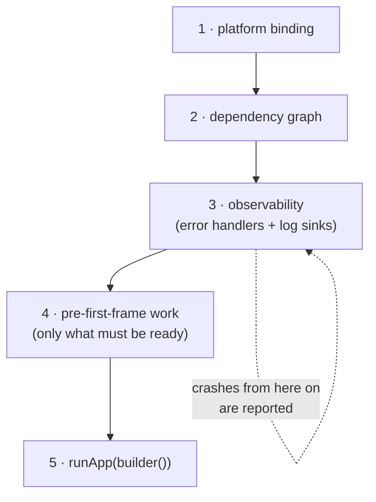

# Pattern — One startup path (`bootstrap()`)

> Portable notes. Nothing here depends on this repo: copy the file into any
> Flutter project (most of it holds for any app with a UI thread and a crash
> reporter). Concrete code is Flutter; the logging layer is pseudocode because
> every project's log backend is different.

---

## 1. The problem

`main()` is the one function every app has, so it is where startup work
accumulates: DI, database open, auth restore, crash reporter, feature flags,
timezone, a first sync. Three failures follow, and all three are ordering
failures rather than coding mistakes:

1. **The window where crashes are invisible.** Whatever runs before the crash
   reporter is installed cannot be reported. That window contains the riskiest
   code in the app — plugin init, DB migration, key material — and its crashes
   only ever happen on someone else's device.
2. **Divergent entry points.** The second the project gets `main_dev.dart` /
   `main_prod.dart`, an integration-test entry, or a `patrol` entry, the
   startup sequence is copy-pasted. One copy then drifts: staging has the crash
   reporter, prod does not, and nobody notices for a month.
3. **Reads before writes.** A widget or a repository resolves a dependency that
   was not registered yet. This crashes on a cold start and works on hot
   reload, which is the worst possible failure signature.

The fix is not "be careful in `main`". It is to give startup **one named
function with an explicit order**, and to keep `main()` down to choosing the
configuration.

---

## 2. The shape

```
main_dev.dart ─┐
main_prod.dart ─┼──> bootstrap(config, () => App()) ──> runApp
test entry     ─┘
```



| Phase              | Contains                                    | Move it later and…                                                                       |
| ------------------ | ------------------------------------------- | ---------------------------------------------------------------------------------------- |
| 1 · Binding        | `WidgetsFlutterBinding.ensureInitialized()` | any plugin touched before it throws — path lookup, secure storage, biometrics            |
| 2 · DI             | register the graph (lazily)                 | phase 3 has no logger to install, and any constructor that resolves a dependency crashes |
| 3 · Observability  | error handlers, log sinks, crash reporter   | every crash before this line is lost, including the ones you most need                   |
| 4 · Pre-frame work | only what the first frame genuinely needs   | the app renders against state that is not there yet                                      |
| 5 · `runApp`       | nothing else                                | —                                                                                        |

**Phase 3 is the point of the whole pattern.** Phases 1, 2, 4 are just work that
has to happen somewhere. Phase 3 is a decision about _when_ observability
starts, and it should start as early as it possibly can — right after the graph
that the logger itself needs.

### Reference implementation (Flutter)

```dart
Future<void> bootstrap(AppConfig config, Widget Function() builder) async {
  // 1 — platform channels. Before everything.
  WidgetsFlutterBinding.ensureInitialized();

  // 2 — dependency graph. Registration only, no construction: lazy
  //     singletons keep I/O off the path to the first frame.
  await configureDependencies(config);
  final logger = resolve<AppLogger>();

  // 3 — observability. Nothing above this line is reportable, so keep the
  //     lines above it few and boring.
  installErrorHandlers(logger);

  // 4 — only what the first frame cannot render without.
  await restoreSession();

  logger.info('app bootstrapped', fields: {'flavor': config.flavor});

  // 5 —
  runApp(builder());
}
```

### Why `builder` is a function, not a widget

`bootstrap(MyApp())` constructs the widget **at the call site**, i.e. before
phase 2 has run. Any constructor or field initialiser that resolves a
dependency blows up. `bootstrap(MyApp.new)` defers construction to phase 5,
after the graph exists. One character of difference, and it is the difference
between "DI is available to widgets" and "DI is available to widgets that
happen not to use it early".

### What does _not_ belong in phase 4

The instinct is to await everything so the app "starts clean". Resist it: every
await here is added cold-start latency in front of a blank screen. The test is
**"can the first frame render truthfully without this?"**

| Belongs in phase 4                                                      | Belongs behind a loading state / lazy resolve                 |
| ----------------------------------------------------------------------- | ------------------------------------------------------------- |
| Anything that decides the _first route_ (auth session, onboarding flag) | opening the local DB, if the first screen can show a skeleton |
| Config the theme depends on                                             | first network sync                                            |
| Encryption key material, if the DB needs it to open                     | background-task registration, connectivity listener           |
| Startup recovery that must precede any write (see §6)                   | analytics / attribution init                                  |

---

## 3. Error handlers — the four channels

An app leaks errors through more than one hole. Missing any of them means a
class of crash your dashboard never shows, which reads as "we have no bugs
there" rather than "we are blind there".

| Channel                               | Catches                                   | Missed if not installed                                        |
| ------------------------------------- | ----------------------------------------- | -------------------------------------------------------------- |
| `FlutterError.onError`                | framework errors: build, layout, paint    | every UI exception                                             |
| `PlatformDispatcher.instance.onError` | uncaught async errors reaching the engine | the forgotten `await`, a rejected `Future` in a stream handler |
| `Isolate.current.addErrorListener`    | errors in a spawned isolate               | background DB work, background sync — silent, always           |
| `runZonedGuarded`                     | errors inside that one zone               | (alternative to the second row, not an addition — see below)   |

```dart
void installErrorHandlers(AppLogger logger) {
  final previous = FlutterError.onError;
  FlutterError.onError = (details) {
    logger.error('uncaught flutter error',
        fields: {'library': details.library},
        error: details.exception, stackTrace: details.stack);
    previous?.call(details);            // keeps the debug console dump
  };

  PlatformDispatcher.instance.onError = (error, stack) {
    logger.error('uncaught async error', error: error, stackTrace: stack);
    return true;                        // handled; false re-reports it
  };
}
```

Two details that are easy to get wrong:

- **Chain, do not replace.** `previous?.call(details)` keeps the default
  handler, which is what prints the red dump in debug. Drop it and you have
  traded your dev-time console output for your production logs.
- **`runZonedGuarded` is a choice, not a requirement.** On current Flutter,
  `PlatformDispatcher.onError` covers the same async errors without forcing
  every error to travel through one zone — which stops working the moment
  background isolates are involved, since a zone does not cross an isolate
  boundary. Pick one. If you keep `runZonedGuarded` (a crash SDK may ask for
  it), be aware `onError` then usually sees nothing, and route both to the same
  logger so it does not matter which fires.
- **Isolates need their own listener**, registered inside the isolate:

```dart
// inside the spawned isolate's entry point
Isolate.current.addErrorListener(RawReceivePort((pair) {
  final [error, stack] = pair as List<Object?>;
  logger.error('uncaught isolate error', error: error, stackTrace: stack);
}).sendPort);
```

---

## 4. Logging with a remote sink (pseudocode)

Phase 3 installs the handlers; where their output _goes_ is a separate
decision. Keep the app talking to one interface and fan out behind it.

```
interface AppLogger
    log(level, message, fields, error, stackTrace)
    debug/info/warn/error(...)          // shorthands
```

```
// The app depends on this and nothing else. Sinks are an implementation
// detail — adding a remote one must not touch a single call site.
class FanOutLogger implements AppLogger
    sinks: List<LogSink>

    log(level, message, fields, error, stack):
        record = LogRecord(
            level, message,
            timestamp = clock.nowUtc(),       // injected clock, not now()
            fields    = redact(fields),       // ← see below, do it HERE
            error, stack,
            context   = {sessionId, buildNumber, flavor, userIdHash})
        for sink in sinks:
            guard: sink.write(record)         // a failing sink must not
                                              // break the others, and must
                                              // never throw into the app
```

**Redact in the shared layer, never in the sink.** If each sink redacts, then
the sink someone adds next year is the one that forgets. Put it in the single
`log()` that all sinks sit behind, and it cannot be bypassed:

```
redact(fields):
    for each key, value:
        if normalize(key) contains any of DENYLIST:   # amount, balance, note,
            value = "[redacted]"                      # email, phone, token,
        else if value is Map or List:                 # secret, password, body…
            value = redact(value)                     # recurse: a DTO dumped
    return fields                                     # under one key leaks all
```

`normalize` lowercases and strips separators, so one entry covers
`amount`, `amountMinor`, `AMOUNT_MINOR` and `amount-minor`.

### The remote sink

A remote sink is not "a sink that also does a POST". Four properties, in order
of how often they are missed:

```
class RemoteLogSink implements LogSink
    buffer:  RingBuffer(capacity = N)      // bounded. drops oldest.
    ready:   false

    write(record):
        if record.level < minRemoteLevel: return        // 1 · threshold
        buffer.add(record)                              // 2 · never blocks
        if ready and buffer.size >= batchSize: scheduleFlush()

    // Called when the transport finishes its own async init, AFTER
    // bootstrap has already installed the error handlers.
    onTransportReady():
        ready = true
        scheduleFlush()

    scheduleFlush():                                    // 3 · off the hot path
        debounce(interval):
            batch = buffer.take(batchSize)
            try: await transport.send(batch)
            catch: buffer.putBack(batch)                // 4 · survive offline
                   retryWithBackoffAndJitter()
```

1. **Never `await` a log call, and never let a sink block the caller.** A log
   line is fire-and-forget. A sink that awaits the network turns a logging
   statement into a latency source and, worse, into a failure source.
2. **Buffer before the transport is ready.** This is the subtle one. A remote
   crash reporter usually needs async init (read a key, open a DB, get a
   session). If phase 3 waits for it, the whole init window is unreported —
   exactly the window you care about. So: install handlers first, let the sink
   buffer into memory, flush when the transport comes up. Startup crashes then
   land in the buffer and go out on the _next_ run, which is why the buffer
   should be backed by durable storage if it matters.
3. **Batch, debounce and cap.** Chatty remote logging costs battery and money
   and gets rate-limited. A ring buffer plus a debounced flush is enough;
   dropping the oldest under pressure is the correct behaviour, and losing a
   `debug` line is fine — which is why remote gets its own, higher, threshold.
4. **Offline is the normal case, not the error case.** Put back the batch on
   failure, retry with exponential backoff **plus jitter** (without jitter,
   every device that lost connectivity at the same moment retries at the same
   moment). If order matters downstream, keep a monotonic sequence number per
   session — server receive time is not the send order.

Two more, cheap to do and expensive to retrofit:

- **Stable context on every record** — session id, build number, flavor,
  platform, and a _hashed_ user id. Without it a remote log is a wall of lines
  you cannot group.
- **A local sink stays in the list.** Local console for development, remote for
  the field; wiring only the remote one makes local debugging worse than it was
  before you had logging at all.

```
// phase 2 registration, per environment
sinks = [ ConsoleSink(minLevel = debug in dev, else off),
          RemoteSink(minLevel = warn),                 # or info, if budget allows
          CrashReporterSink() ]                        # error-level breadcrumbs
```

---

## 5. Multiple entry points

```dart
// main_dev.dart
Future<void> main() => bootstrap(AppConfig.dev, App.new);

// main_prod.dart
Future<void> main() => bootstrap(AppConfig.prod, App.new);

// integration_test / e2e entry
Future<void> main() => bootstrap(AppConfig.test, App.new);
```

Each entry answers exactly one question — _which configuration_ — and the
sequence lives in one place. The moment an entry point contains a second
statement, ask why it is not in `bootstrap`.

The rule that keeps this honest: **`main()` has no logic.** No `if`, no
`try`, no init call. If a flavor needs different behaviour, that is a field on
the config, not a line in `main`.

---

## 6. Growth points

`bootstrap` is expected to grow. That is the payoff — one file where the
startup sequence is readable — and the reason it stays readable is that each
new item states which phase it belongs to and why.

| Added later                   | Phase                              | Note                                               |
| ----------------------------- | ---------------------------------- | -------------------------------------------------- |
| Crash reporter SDK            | 3                                  | as early as its own init allows; buffer until then |
| Local database open           | 4, or lazy                         | phase 4 only if the first frame reads it           |
| Encryption key material       | 4                                  | before the DB, if the DB needs it                  |
| Auth session restore          | 4                                  | decides the first route                            |
| Remote config / feature flags | 4 with a **timeout and a default** | never block a cold start on a network call         |
| Connectivity listener         | after `runApp`                     | a signal, not a precondition                       |
| Background task registration  | after `runApp`                     |                                                    |
| **Startup recovery**          | 4                                  | see below                                          |
| First sync trigger            | after `runApp`                     | never awaited                                      |

**Startup recovery deserves the phase-4 slot.** Any app with a durable write
queue can be killed mid-flush, leaving rows in a transient state
(`processing`, `uploading`, `pending-ack`). Nobody will ever move them back,
because the code that would have is the code that died. So on every start,
before anything is allowed to write: reset orphaned transient rows to their
retryable state, then start. This is a five-line query that is the difference
between an outbox that self-heals and one that silently stops draining.

---

## 7. Testing it

- **Assert the order, not the effects.** Register spies for the phases and
  assert the sequence: binding → graph → handlers → work → `runApp`. That test
  fails when someone moves an init call above the handlers, which is the
  regression that actually happens and the one you never see by hand.
- **Assert the reporting window is closed.** Throw from a phase-4 step and
  assert the logger received it. This is the pattern's whole value; it should
  be the loudest test in the file.
- **Assert the graph, in an isolated container.** Configure into a _private_
  DI container per test, never the global one, or one test's registrations leak
  into the next.
- **Assert the sink contract instead of the sink.** You cannot read back a real
  crash reporter, so inject a recording sink and assert what _would_ have been
  sent — above all that redacted fields never appear in it.
- **Fake the clock.** Timestamps and any backoff are then deterministic, and no
  test needs a real delay.

---

## 8. Anti-patterns

1. **Init work in `main()`.** It will be copy-pasted into the next entry point.
2. **Crash reporter installed after the risky init.** Blind exactly where it
   matters, and the blindness is invisible.
3. **Passing a constructed widget** instead of a builder, so the widget tree is
   built before DI exists.
4. **`await` on everything before `runApp`** — a blank screen for as long as
   the slowest dependency, usually the network.
5. **Blocking a cold start on remote config** with no timeout and no default.
6. **Redaction inside each sink.** The next sink forgets; the leak is silent.
7. **An unbounded log buffer.** Fixes a dropped line, adds an OOM.
8. **`DateTime.now()` inside the logger.** Cheap to inject a clock, and it
   makes every timestamp assertion testable.
9. **Only a remote sink.** Local debugging gets worse than having no logging.
10. **No isolate error listener** once background work exists. Those crashes
    are silent by default, and background work is where the hard bugs live.
