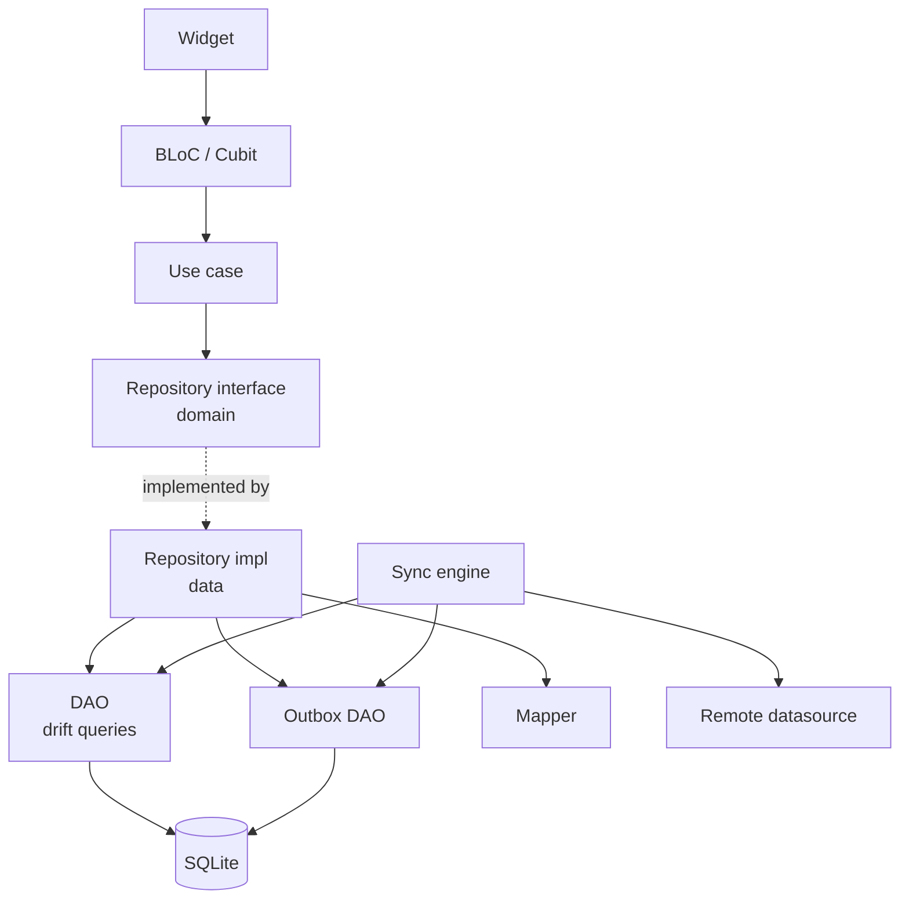
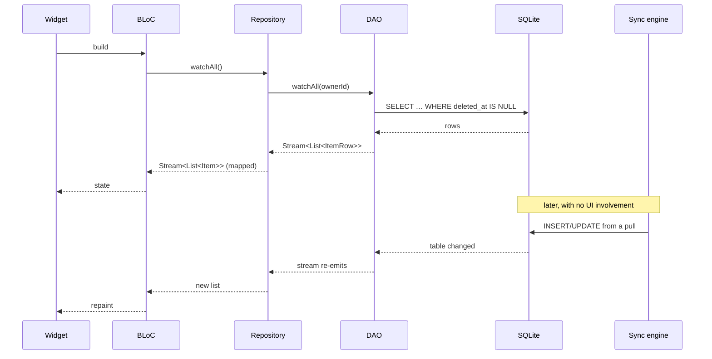
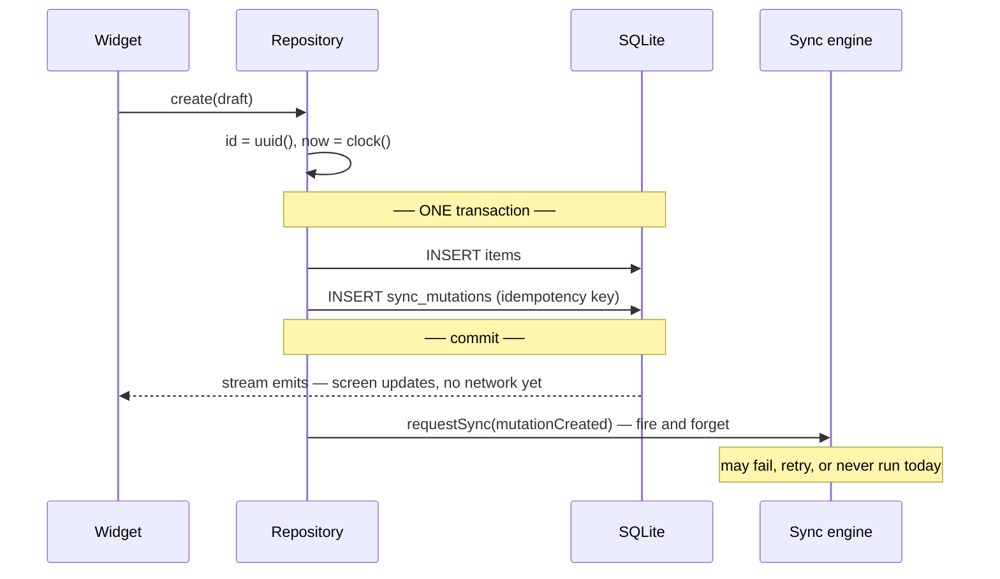

# Pattern — Local storage as the source of truth (Drift)

> Portable notes. Nothing here depends on this repo: the entity is called
> `Item`, the database `AppDatabase`, and no type carries a project prefix.
> Code is Dart + Drift 2.31; the shape holds for any local-first store with
> transactions and reactive queries.

---

## 1. The problem

An app that reads the network to paint a screen has one failure mode with many
faces: the screen is empty on a train, the spinner never ends on hotel Wi-Fi, a
saved row disappears when the response times out. Adding a cache does not fix
it — it moves the question to *which* of the two stores was right.

Three specific mistakes produce almost all of it:

1. **The UI reads a response.** A widget calls the API and renders what comes
   back. Offline it renders nothing, and the local copy — if there is one — is
   a second truth nobody reconciles.
2. **The repository forwards.** `create()` calls the datasource and returns.
   Now "was this saved?" and "was this sent?" are the same question, and the
   answer is "no" for both the moment a request fails.
3. **One class plays three roles.** The JSON model, the domain object and the
   database row are the same class, so a column rename reaches the domain, a
   server field reaches the schema, and the migration nobody wrote is the one
   that breaks.

The pattern is one sentence:

> **Write locally inside a transaction, read locally through a stream, and let
> the network catch up afterwards.**

Everything below is the mechanics of keeping that sentence true.

---

## 2. The shape



Two properties do the work, and both are structural rather than disciplinary:

- **The only arrow into the UI comes from the database.** Not from the
  repository's return value, not from the sync engine. A write repaints the
  screen because it changed a table, not because someone remembered to call
  `emit`.
- **The sync engine and the UI never talk.** They meet in SQLite. That is why
  a background pull updating 400 rows needs no knowledge of which screens are
  open.

### Who may import what

| Layer          | May import                                  | Must not import                          |
| -------------- | ------------------------------------------- | ---------------------------------------- |
| `presentation` | domain entities, use cases                  | drift, the HTTP client, DTOs, row types  |
| `domain`       | nothing but Dart and its own types          | drift, the HTTP client, DTOs, row types  |
| `data`         | drift, the HTTP client, domain (to satisfy) | widgets, `BuildContext`                  |

The rule that keeps this honest: **the row type never leaves `data/`.** If
`ItemRow` appears in a BLoC, the layering is already gone — a schema change now
reaches the UI.

---

## 3. Three models, not one

The same field, three times, on purpose:

| Concern      | `ItemRow` (data)             | `Item` (domain)        | `ItemDto` (data)        |
| ------------ | ---------------------------- | ---------------------- | ----------------------- |
| Generated by | drift, from the table        | hand-written           | JSON codegen            |
| Amount       | `int amountMinorUnits`       | `Money amount`         | `int amount_minor`      |
| Kind         | `String kind`                | `enum ItemKind`        | `String kind`           |
| Time         | `int occurredAt` (ms, UTC)   | `DateTime occurredAt`  | `String occurred_at`    |
| Answers      | "what does SQLite hold?"     | "what are the rules?"  | "what is on the wire?"  |

The cost is two mappers. What they buy: a server renaming `amount_minor`
changes one mapper; a column split changes the other; the domain — where the
rules live — changes when the *rules* change and at no other time.

---

## 4. The read flow



Three things to hold on to:

- **It is a `Stream` from the DAO to the widget, unbroken.** The moment one
  layer converts it to a `Future`, the loop in the lower half of that diagram
  is gone and something has to invalidate by hand.
- **The mapping happens in the repository**, on the way out. Below it,
  everything is rows; above it, everything is entities.
- **Drift invalidates per table, not per row.** A watcher of one row re-runs
  its query when *anything* in that table changes, even if the result is
  identical. Cheap on a small table, worth measuring on a large one — the fix
  is `.distinct()` or a narrower query, never a hand-rolled invalidation
  scheme, which is the bug this pattern exists to avoid.

---

## 5. The write flow



The invariant the transaction protects:

> **If the entity exists locally and needs syncing, its mutation exists too.**

Split those two inserts and a crash between them produces a row that will never
reach the server, with nothing anywhere to detect it. This is the single most
important line of the pattern, and it costs one `transaction {}` block.

Four smaller rules follow from it:

- **The ID is generated on the client.** Waiting for a server ID means the row
  cannot be written offline, which defeats the whole thing.
- **The idempotency key belongs to the mutation** and never changes across
  retries. It is what makes "request succeeded, response lost" survivable.
- **`requestSync` is fired after the transaction commits, never inside it.** An
  unawaited future started inside can outlive the transaction and run against a
  closed executor.
- **Delete is a soft delete.** A hard delete has nothing left to tell the
  server about.

---

## 6. The code

### 6.1 Table — `data/tables/items_table.dart`

```dart
import 'package:drift/drift.dart';

@DataClassName('ItemRow')
// The composite index the list screen actually uses. DESC in the index matters
// once the table is large: it lets `ORDER BY occurred_at DESC` read the b-tree
// in order instead of sorting the result set.
@TableIndex(
  name: 'items_owner_occurred',
  columns: {#ownerId, IndexedColumn(#occurredAt, orderBy: OrderingMode.desc)},
)
@TableIndex(name: 'items_sync_status', columns: {#syncStatus})
class ItemsTable extends Table {
  // Client-generated UUID, not an autoIncrement int: a row must have its final
  // identity before anything reaches the network.
  TextColumn get id => text()();
  TextColumn get ownerId => text()();
  TextColumn get name => text()();

  // Enum stored by NAME, never by index. Reordering the Dart enum would
  // silently reinterpret every existing row if this held an ordinal.
  TextColumn get kind => text()();

  // Money as integer minor units + a currency code. No double, ever: 0.1 + 0.2
  // is a rounding bug that only shows up in someone's balance.
  IntColumn get amountMinorUnits => integer()();
  TextColumn get currencyCode => text().withLength(min: 3, max: 3)();

  // Timestamps as epoch millis, UTC. Not ISO strings (unsortable as text
  // across offsets, three times the bytes) and not drift's `dateTime()`, whose
  // storage depends on a build option that is easy to change by accident.
  IntColumn get occurredAt => integer()();
  IntColumn get createdAt => integer()();
  IntColumn get updatedAt => integer()();

  // Sync columns. `version` powers optimistic concurrency; `deletedAt` is the
  // soft delete; `syncStatus` is a local-only hint for the UI.
  IntColumn get version => integer().withDefault(const Constant(1))();
  IntColumn get deletedAt => integer().nullable()();
  TextColumn get syncStatus => text().withDefault(const Constant('pending'))();

  @override
  Set<Column<Object>> get primaryKey => {id};

  // Stated, not derived from the class name: a Dart rename must not silently
  // become a schema change.
  @override
  String get tableName => 'items';
}
```

### 6.2 DAO — `data/daos/item_dao.dart`

The DAO speaks SQL and rows. It holds no policy: no clock, no UUIDs, no outbox,
no "should this sync". Those belong one layer up.

```dart
import 'package:drift/drift.dart';

part 'item_dao.g.dart';

@DriftAccessor(tables: [ItemsTable])
class ItemDao extends DatabaseAccessor<AppDatabase> with _$ItemDaoMixin {
  // `super.attachedDatabase`, not `super.db`: the name must match the
  // generated parameter or the analyzer fights you over it.
  ItemDao(super.attachedDatabase);

  /// The list screen. Soft-deleted rows are filtered here, once, so no caller
  /// can forget — the most common source of "I deleted it and it came back".
  Stream<List<ItemRow>> watchAll(String ownerId) {
    return (select(itemsTable)
          ..where((t) => t.ownerId.equals(ownerId) & t.deletedAt.isNull())
          ..orderBy([(t) => OrderingTerm.desc(t.occurredAt)]))
        .watch();
  }

  Future<ItemRow?> findById(String id) =>
      (select(itemsTable)..where((t) => t.id.equals(id))).getSingleOrNull();

  Future<void> insertRow(ItemsTableCompanion row) => into(itemsTable).insert(row);

  /// Returns the number of rows written, which is what makes optimistic
  /// concurrency checkable: 0 means the row moved under us.
  Future<int> updateRow(String id, int baseVersion, ItemsTableCompanion patch) {
    return (update(itemsTable)
          ..where((t) => t.id.equals(id) & t.version.equals(baseVersion)))
        .write(patch);
  }

  Future<int> softDelete(String id, int now) {
    return (update(itemsTable)..where((t) => t.id.equals(id) & t.deletedAt.isNull()))
        .write(ItemsTableCompanion(deletedAt: Value(now), updatedAt: Value(now)));
  }

  /// Aggregates run in SQLite, not in Dart. Loading every row to fold it in
  /// memory is the thing this store was chosen to avoid.
  Future<int> totalMinorUnits(String ownerId) async {
    final total = itemsTable.amountMinorUnits.sum();
    final query = selectOnly(itemsTable)
      ..addColumns([total])
      ..where(itemsTable.ownerId.equals(ownerId) & itemsTable.deletedAt.isNull());

    return (await query.getSingle()).read(total) ?? 0;
  }
}
```

### 6.3 Domain — entity and interface

No drift import, no JSON, no Flutter. This file should compile in a plain Dart
package.

```dart
// domain/entities/item.dart
class Item {
  const Item({
    required this.id,
    required this.name,
    required this.kind,
    required this.amount,
    required this.occurredAt,
    required this.version,
  });

  final String id;
  final String name;
  final ItemKind kind;
  final Money amount;
  final DateTime occurredAt;
  final int version;
}

enum ItemKind { inbound, outbound }

/// What the UI submits — no id, no version, no timestamps. Those are the
/// repository's job, and a draft that carried them could lie about them.
class ItemDraft {
  const ItemDraft({required this.name, required this.kind, required this.amount, required this.occurredAt});

  final String name;
  final ItemKind kind;
  final Money amount;
  final DateTime occurredAt;
}

// domain/repositories/item_repository.dart
abstract interface class ItemRepository {
  Stream<List<Item>> watchAll();
  Future<Item?> findById(String id);
  Future<void> create(ItemDraft draft);
  Future<void> update(Item item);
  Future<void> delete(String id);
}
```

Note what the interface does **not** expose: no `sync()`, no `refresh()`, no
`isOnline`. A caller that can ask for those will eventually branch on them, and
the branch will be wrong offline.

### 6.4 Mapper — `data/mappers/item_mapper.dart`

```dart
abstract final class ItemMapper {
  static Item toEntity(ItemRow row) => Item(
        id: row.id,
        name: row.name,
        kind: _kind(row.kind),
        amount: Money(row.amountMinorUnits, row.currencyCode),
        occurredAt: DateTime.fromMillisecondsSinceEpoch(row.occurredAt, isUtc: true),
        version: row.version,
      );

  static ItemsTableCompanion draftToInsert(
    ItemDraft draft, {
    required String id,
    required String ownerId,
    required int now,
  }) {
    return ItemsTableCompanion.insert(
      id: id,
      ownerId: ownerId,
      name: draft.name,
      kind: draft.kind.name,
      amountMinorUnits: draft.amount.minorUnits,
      currencyCode: draft.amount.currencyCode,
      occurredAt: draft.occurredAt.millisecondsSinceEpoch,
      createdAt: now,
      updatedAt: now,
      // version, deletedAt, syncStatus are left absent — the schema defaults
      // own them, so there is one place that decides what a new row looks like.
    );
  }

  /// The outbox payload — the same row, in the shape the wire expects. It lives
  /// here rather than on the DTO because what gets *sent* is decided by what was
  /// *stored*, not by what some earlier response happened to contain.
  static Map<String, Object?> toPayload(ItemsTableCompanion row) => {
        'id': row.id.value,
        'name': row.name.value,
        'kind': row.kind.value,
        'amount_minor': row.amountMinorUnits.value,
        'currency_code': row.currencyCode.value,
        'occurred_at': row.occurredAt.value,
      };

  /// A value the database does not recognise must not crash the list screen.
  /// A newer client version writing a new kind is a normal event once two
  /// devices sync; falling back beats throwing inside a stream.
  static ItemKind _kind(String raw) =>
      ItemKind.values.firstWhere((k) => k.name == raw, orElse: () => ItemKind.outbound);
}
```

### 6.5 Repository impl — where the policy lives

This is the file that makes the repository more than a forwarder.

```dart
class ItemRepositoryImpl implements ItemRepository {
  ItemRepositoryImpl({
    required AppDatabase db,
    required ItemDao items,
    required OutboxDao outbox,
    required Session session,
    required Clock clock,
    required UuidGenerator uuid,
    required SyncScheduler sync,
  })  : _db = db,
        _items = items,
        _outbox = outbox,
        _session = session,
        _clock = clock,
        _uuid = uuid,
        _sync = sync;

  final AppDatabase _db;
  final ItemDao _items;
  final OutboxDao _outbox;
  final Session _session;
  final Clock _clock;
  final UuidGenerator _uuid;
  final SyncScheduler _sync;

  @override
  Stream<List<Item>> watchAll() =>
      _items.watchAll(_session.ownerId).map((rows) => rows.map(ItemMapper.toEntity).toList());

  @override
  Future<Item?> findById(String id) async {
    final row = await _items.findById(id);
    return row == null ? null : ItemMapper.toEntity(row);
  }

  @override
  Future<void> create(ItemDraft draft) async {
    final id = _uuid.v7();
    final now = _clock.nowUtcMillis();
    final row = ItemMapper.draftToInsert(draft, id: id, ownerId: _session.ownerId, now: now);

    // The invariant, in one place. Every DAO attached to THIS database instance
    // joins this transaction automatically — drift tracks it through the zone —
    // so the two inserts commit together or not at all.
    await _db.transaction(() async {
      await _items.insertRow(row);
      await _outbox.enqueue(
        entityType: 'item',
        entityId: id,
        operation: MutationOperation.create,
        // Generated once, reused by every retry. This is what lets the server
        // recognise a duplicate after a timeout.
        idempotencyKey: _uuid.v4(),
        baseVersion: 0,
        payload: ItemMapper.toPayload(row),
        createdAt: now,
      );
    });

    // AFTER the commit, and deliberately not awaited: the user's work is
    // already safe, and the network is allowed to be slow, absent or broken.
    unawaited(_sync.request(SyncReason.mutationCreated));
  }

  @override
  Future<void> delete(String id) async {
    final now = _clock.nowUtcMillis();
    final existing = await _items.findById(id);
    if (existing == null || existing.deletedAt != null) return; // idempotent

    await _db.transaction(() async {
      await _items.softDelete(id, now);
      await _outbox.enqueue(
        entityType: 'item',
        entityId: id,
        operation: MutationOperation.delete,
        idempotencyKey: _uuid.v4(),
        baseVersion: existing.version,
        payload: const {},
        createdAt: now,
      );
    });

    unawaited(_sync.request(SyncReason.mutationCreated));
  }
}
```

### 6.6 Above the repository

Thin by design — if these files get interesting, policy has leaked upward.

```dart
// domain/usecases/create_item.dart
class CreateItem {
  const CreateItem(this._repository);
  final ItemRepository _repository;

  Future<void> call(ItemDraft draft) {
    if (draft.name.trim().isEmpty) throw const ValidationFailure.emptyName();
    return _repository.create(draft);
  }
}

// presentation/bloc/item_list_cubit.dart
class ItemListCubit extends Cubit<ItemListState> {
  ItemListCubit(this._repository) : super(const ItemListState.loading()) {
    // One subscription, for the lifetime of the cubit. No manual refresh
    // anywhere in the app — a write repaints because the table changed.
    _sub = _repository.watchAll().listen(
          (items) => emit(ItemListState.data(items)),
          onError: (Object e) => emit(const ItemListState.failure()),
        );
  }

  final ItemRepository _repository;
  late final StreamSubscription<List<Item>> _sub;

  @override
  Future<void> close() async {
    await _sub.cancel();
    return super.close();
  }
}
```

---

## 7. Tests

An in-memory database makes every one of these hermetic and fast — no fixtures,
no cleanup, no shared state.

```dart
late AppDatabase db;
late ItemRepositoryImpl repository;

setUp(() {
  db = AppDatabase.forTesting(NativeDatabase.memory());
  repository = ItemRepositoryImpl(db: db, items: ItemDao(db), outbox: OutboxDao(db), /* fakes */);
});

tearDown(() async => db.close());
```

The four tests worth writing first, in order of what they protect:

```dart
test('create() writes the entity and its mutation in one transaction', () async {
  await repository.create(draft);

  expect(await db.select(db.itemsTable).get(), hasLength(1));
  expect(await db.select(db.syncMutationsTable).get(), hasLength(1));
});

test('a failure mid-transaction leaves neither row behind', () async {
  outbox.failOnNextEnqueue();          // a fake that throws

  await expectLater(repository.create(draft), throwsA(isA<Exception>()));

  // The point of the whole pattern: no orphan entity waiting for a mutation
  // that does not exist.
  expect(await db.select(db.itemsTable).get(), isEmpty);
});

test('watchAll() re-emits when a row is written by something else', () async {
  final emissions = <int>[];
  final sub = repository.watchAll().listen((items) => emissions.add(items.length));

  await pumpEventQueue();
  await db.into(db.itemsTable).insert(someRow);   // as a sync pull would
  await pumpEventQueue();
  await sub.cancel();

  expect(emissions, [0, 1]);
});

test('delete() soft-deletes and hides the row from reads', () async {
  await repository.create(draft);
  final id = (await db.select(db.itemsTable).getSingle()).id;

  await repository.delete(id);

  expect(await repository.watchAll().first, isEmpty);          // gone from the UI
  expect(await db.select(db.itemsTable).get(), hasLength(1));  // still on disk
});
```

Fakes, not mocks, for `Clock` and `UuidGenerator`: a test that states the time
and the id reads as a specification instead of a recording.

---

## 8. Traps

| Trap | What happens | What to do |
| --- | --- | --- |
| `Value(null)` vs `Value.absent()` in a companion | `Value(null)` **writes NULL**; `absent()` leaves the column alone. Confusing them nulls a column on every partial update | Build update companions explicitly, never by copying a full row |
| A DAO built on a *different* database instance | Drift resolves the transaction through the zone and compares `attachedDatabase`; a foreign DAO silently commits **outside** your transaction | One database instance, injected; DAOs are constructed from it |
| `unawaited(...)` inside `transaction()` | The future can outlive the block and run against a closed executor | Fire it after the commit |
| Reads that forget `deletedAt IS NULL` | Soft-deleted rows reappear in one screen and not another | Filter in the DAO, once, never at call sites |
| Enum stored by index | Reordering the Dart enum reinterprets every existing row | Store `.name`, read with a fallback |
| `DateTime` columns | Storage format depends on a build option; text storage sorts wrongly across offsets | Store `int` epoch millis, convert in the mapper |
| Stream invalidation is per table | A watcher re-runs on unrelated writes to the same table | Fine until it is measured to be a problem; then `.distinct()` or a narrower query |
| Codegen output and the formatter | Generators write at their own line width; a repo with a wider setting fails its own format check on a file nobody wrote | Chain `build_runner build && dart format .` |
| Generated files not committed | CI without a codegen step fails on a clean clone | Commit them — a schema diff in review is a feature |
| Row types escaping `data/` | A schema change reaches the UI | Grep for the row type outside `data/`; it should never appear |

---

## 9. Where the pieces live

```
lib/
├── core/database/
│   ├── database.dart            # AppDatabase, schemaVersion, MigrationStrategy
│   └── tables/                  # tables owned by no feature (settings, outbox)
└── features/<feature>/
    ├── data/
    │   ├── tables/              # the feature's tables
    │   ├── daos/                # queries only
    │   ├── dto/                 # wire shape
    │   ├── mappers/             # row ↔ entity, dto ↔ entity
    │   └── repositories/        # the impl — transactions, outbox, policy
    ├── domain/
    │   ├── entities/            # entity + draft + enums
    │   ├── repositories/        # the interface
    │   └── usecases/
    └── presentation/            # bloc, pages, widgets
```

Build it bottom-up, one layer per sitting: **table → DAO → entity → repository
interface → mapper → repository impl → use case → BLoC → UI.** Going the other
way produces a UI that dictates the schema, which is how the three-model rule
gets lost on day one.
