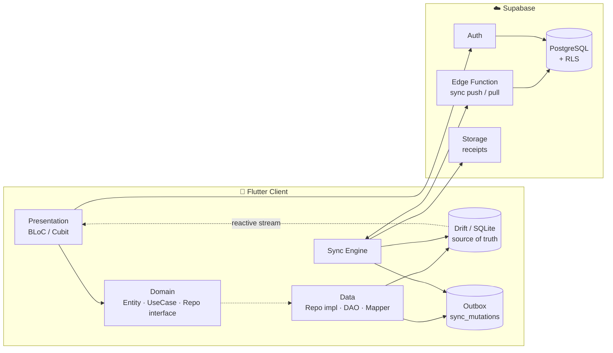
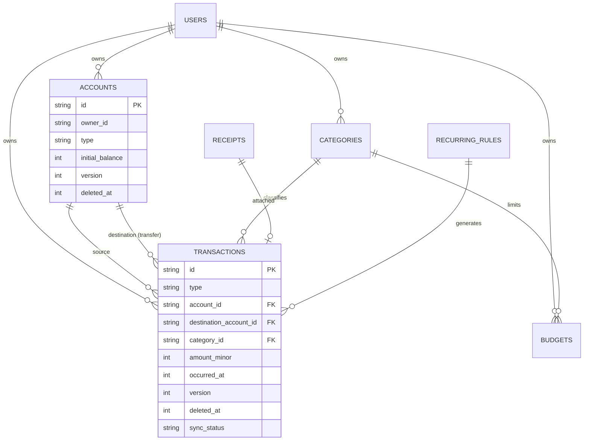
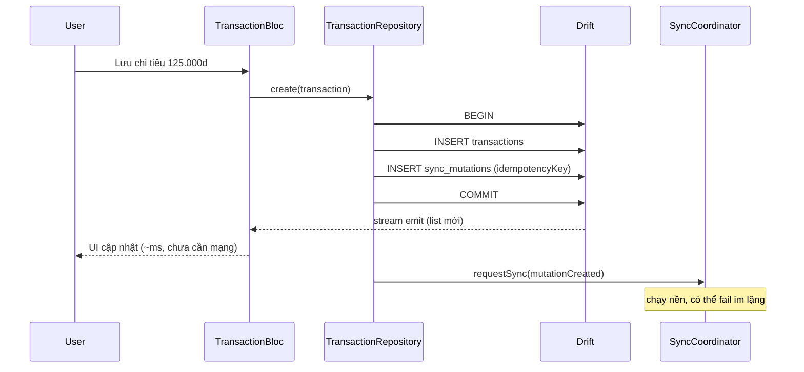
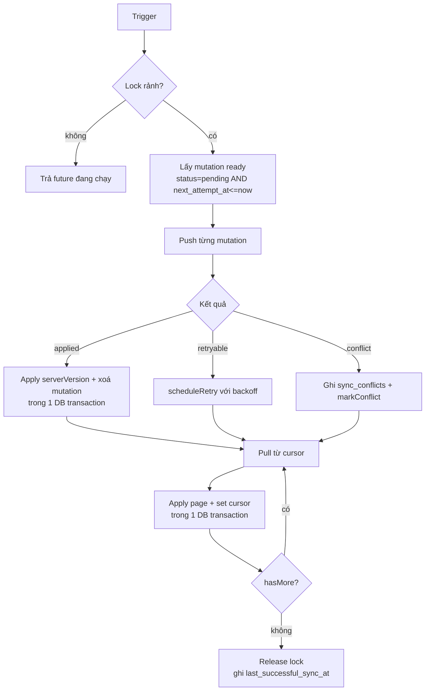
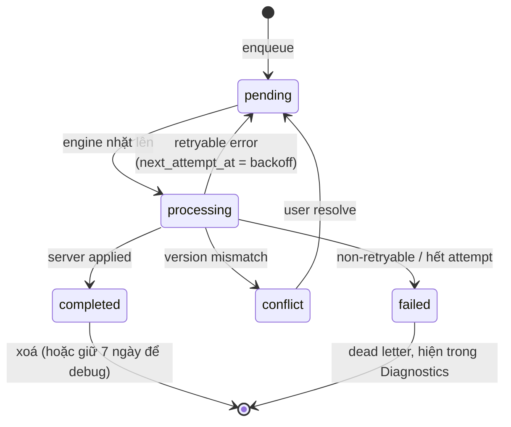

# System Design — Finance App

> Bản đề xuất. Sau khi code xong Phase 4, hãy **viết lại file này bằng ngôn ngữ của bạn** — bản viết sau khi va thực tế mới là bản dùng được khi phỏng vấn.

---

## 1. Bối cảnh & ràng buộc

**Vấn đề:** người dùng ghi chi tiêu ở những nơi mạng tệ (siêu thị tầng hầm, máy bay, metro) và dùng nhiều thiết bị. App phải ghi được ngay lập tức, không bao giờ mất dữ liệu, và không tạo bản ghi trùng khi mạng quay lại.

**Ràng buộc thiết kế:**

| Ràng buộc | Hệ quả |
|---|---|
| Mạng không đáng tin cậy | Local-first, mọi write đi vào local DB trước |
| Client có thể bị kill bất kỳ lúc nào | Mutation queue phải durable, ghi cùng transaction với entity |
| Nhiều thiết bị, cùng 1 user | Cần sync 2 chiều + phát hiện conflict |
| Dữ liệu tài chính | Không sai số làm tròn, không leak trong log |
| Dataset 10k–50k transaction | Query phải có index, không load hết vào RAM |
| Đây là portfolio, không phải startup | Ưu tiên depth kỹ thuật hơn số lượng feature |

**Non-goals:** ngân hàng thật, Open Banking, payment, KYC, double-entry accounting đầy đủ, realtime collaborative editing.

---

## 2. Kiến trúc tổng thể



**Luồng dữ liệu một chiều quan trọng nhất:**

```
User action → Repository → [DB transaction: entity + mutation] → UI update (qua stream)
                                    ↓ (bất đồng bộ, có thể muộn hàng giờ)
                              Sync Engine → Server
```

UI **không bao giờ** đợi network. Network chỉ ảnh hưởng tới một badge trạng thái.

---

## 3. Thành phần chính

| Component | Trách nhiệm | Không làm |
|---|---|---|
| `AppDatabase` (Drift) | Schema, migration, transaction boundary, reactive query | Business rule |
| `XxxRepositoryImpl` | Ghi entity + enqueue mutation atomically, map DTO↔entity, quyết định policy local/remote | Gọi trực tiếp từ UI |
| `SyncQueueRepository` | CRUD outbox, chọn mutation ready theo `next_attempt_at` | Gọi network |
| `SyncEngine` | Điều phối 1 chu kỳ sync: lock → push → pull → apply → cursor | Biết chi tiết từng entity |
| `RemoteChangeApplier` | Apply 1 change từ server vào local, xử lý va chạm với pending local | Gọi network |
| `SyncCoordinator` | Nhận trigger (start/resume/connectivity/manual/background), debounce, gọi engine | Chứa logic sync |
| `RetryPolicy` | Tính `nextAttemptAt`, phân loại retryable | Ghi DB |
| `ConflictResolver` | Áp policy theo entity type | Quyết định UI |
| `Clock` / `UuidGenerator` | Abstraction để test được | — |

`Clock` và `UuidGenerator` nghe thừa, nhưng nếu không có chúng thì test sync engine sẽ phải `sleep` thật và không deterministic. Đăng ký chúng từ ngày đầu.

---

## 4. Data model



### Quy ước bắt buộc

Mọi bảng đồng bộ được có 5 cột hạ tầng: `owner_id`, `created_at`, `updated_at`, `version`, `deleted_at`.

| Quyết định | Lý do |
|---|---|
| `id` = UUID do client sinh | Tạo được offline, idempotent khi push, không cần round-trip lấy ID |
| `amount_minor INTEGER` | Tránh sai số float. VND exponent 0, USD exponent 2 |
| Timestamp = epoch millis UTC | So sánh & index rẻ, không ambiguity timezone |
| `deleted_at` thay vì DELETE | Tombstone cần thiết để propagate xoá qua sync |
| `version INTEGER` | Optimistic concurrency, phát hiện conflict |
| Balance **không** lưu cột | Derived value dễ lệch; tính bằng aggregate query có index |

### Transfer

Một transfer = **một** row `transactions` với `type = transfer`, `account_id` (nguồn) và `destination_account_id` (đích). Không tạo 2 row đối ứng.

Đánh đổi: tính balance phức tạp hơn một chút —

```sql
balance(A) = initial_balance
           + Σ(income vào A)
           - Σ(expense từ A)
           - Σ(transfer có account_id = A)
           + Σ(transfer có destination_account_id = A)
```

Nhưng đổi lại không bao giờ có tình trạng "nửa transfer" khi sync lỗi. Đây là trade-off đáng viết ADR.

---

## 5. Offline-first: đường ghi



**Bất biến cốt lõi:**

> Nếu entity tồn tại ở local và cần sync, thì mutation tương ứng **phải** tồn tại và durable.

Bất biến này chỉ đúng nếu hai lệnh INSERT nằm trong cùng một `database.transaction()`. Tách ra là bug tiềm ẩn nghiêm trọng nhất của kiến trúc này — crash ở giữa sẽ tạo ra một transaction vĩnh viễn không bao giờ lên server, và không có cách nào phát hiện.

---

## 6. Sync protocol

### 6.1 Chu kỳ



**Thứ tự: push trước, pull sau.** Lý do: local mutation phản ánh ý định mới nhất của user; đẩy lên trước giúp server có version mới nhất, sau đó pull sẽ trả về trạng thái đã hội tụ, tránh việc pull ghi đè lên thay đổi local chưa kịp gửi. Đây là quyết định cần ADR — phương án `pull → push → pull` cũng hợp lệ và giảm conflict, nhưng tốn 2 round-trip.

### 6.2 API contract

```http
POST /v1/sync/push
{
  "deviceId": "device-a",
  "mutations": [{
    "mutationId": "...", "entityType": "transaction", "entityId": "...",
    "operation": "upsert", "baseVersion": 3,
    "idempotencyKey": "...", "payload": { ... }
  }]
}
→ { "results": [{ "mutationId":"...", "status":"applied|conflict|rejected",
                  "serverVersion": 4, "serverUpdatedAt": "...", "remoteEntity": {...} }] }
```

```http
GET /v1/sync/pull?cursor=<opaque>&limit=200
→ { "changes": [{ "entityType":"transaction", "operation":"upsert|delete", "entity": {...} }],
    "nextCursor": "...", "hasMore": false }
```

**Cursor** là composite `(updated_at, id)` encode base64, không phải wall-clock timestamp của client. Lý do: clock skew giữa thiết bị và server có thể làm bỏ sót record; composite cursor còn xử lý được nhiều record cùng `updated_at`.

### 6.3 State machine của mutation



**Recovery khi khởi động app:** mọi mutation đang ở `processing` là mồ côi (app bị kill giữa chừng) → reset về `pending`. An toàn vì idempotency key bảo vệ khỏi apply hai lần.

### 6.4 Idempotency

Đây là phần dễ làm sai nhất. Kịch bản:

```
Client push → Server apply thành công → Response mất do timeout
→ Client tưởng fail → retry → Server apply lại → 2 transaction 125.000đ
```

Cách xử lý:

1. `idempotencyKey` sinh **một lần** lúc enqueue, giữ nguyên qua mọi lần retry.
2. Server có bảng `processed_mutations(idempotency_key PRIMARY KEY, result_json, created_at)`.
3. Server: nếu key đã tồn tại → trả về `result_json` cũ, **không** apply lại.
4. Cleanup key cũ hơn 30 ngày.

Điểm phụ trợ: vì `id` do client sinh, upsert theo primary key vốn đã idempotent cho phần lớn trường hợp. `processed_mutations` xử lý nốt phần còn lại (chuỗi thao tác không idempotent, và trả về đúng `serverVersion` cho client).

### 6.5 Retry

```
delay = min(baseDelay × 2^attempt, maxDelay) × (0.5 + random × 0.5)
baseDelay = 2s, maxDelay = 30min, maxAttempts = 10
```

| Loại lỗi | Retry? |
|---|---|
| Network unreachable, DNS, timeout | ✅ |
| 5xx | ✅ |
| 429 | ✅ (ưu tiên `Retry-After`) |
| 401 | ⚠️ refresh token → retry đúng 1 lần |
| 400 validation, 403 | ❌ dead letter |
| 409 conflict | ❌ đi vào luồng conflict |

Jitter là bắt buộc: không có nó, khi server phục hồi sau downtime, toàn bộ client sẽ đồng loạt gửi lại cùng lúc.

---

## 7. Conflict resolution

**Optimistic concurrency dựa trên version:**

```sql
UPDATE transactions
SET ..., version = version + 1, updated_at = now()
WHERE id = $1 AND version = $2 AND owner_id = auth.uid();
-- affected rows = 0 → conflict
```

Policy khác nhau theo entity — không cần một policy cho tất cả:

| Entity | Policy | Lý do |
|---|---|---|
| Transaction | Explicit conflict, hỏi user | Sai số tiền là sai nghiêm trọng |
| Account (rename) | Last-write-wins | Rủi ro thấp |
| Category | Server-wins | Ít khi user cố tình sửa 2 nơi |
| Budget | Explicit conflict | Ảnh hưởng cảnh báo chi tiêu |
| Settings | Last-write-wins | Không quan trọng |
| Delete vs Update | Delete thắng | Không "hồi sinh" thứ user đã xoá |

Khi conflict, lưu đủ `localValue`, `remoteValue`, `baseVersion` để UI hiển thị được cả hai bên. Nếu chỉ lưu "có conflict" thì không dựng lại được màn hình resolve.

---

## 8. Bảng failure mode

Bảng này chính là thứ nên đưa ra khi phỏng vấn hỏi "bạn xử lý edge case thế nào".

| Tình huống | Cơ chế xử lý |
|---|---|
| App kill sau khi insert entity, trước khi insert mutation | Không thể xảy ra — cùng DB transaction |
| App kill giữa lúc push | Mutation vẫn `processing` → reset `pending` khi start → idempotency chặn duplicate |
| Server apply xong, client timeout | `processed_mutations` trả kết quả cũ |
| App kill giữa lúc apply pull page | Cursor và changes cùng 1 transaction → rollback → pull lại từ cursor cũ |
| Hai sync trigger cùng lúc | Single-flight lock trả về future đang chạy |
| Có Wi-Fi nhưng không có internet (captive portal) | Connectivity chỉ là *signal*; request thật quyết định; lỗi → retry backoff |
| Device A edit, device B xoá | Delete-wins, ghi vào conflict log để user biết |
| Đồng hồ máy sai 2 ngày | Cursor dùng server time, không dùng client time |
| Token hết hạn giữa sync | 401 → refresh → retry 1 lần → nếu vẫn fail thì dừng sync, giữ nguyên mutation |
| User logout | Xoá local DB + secure storage + huỷ sync đang chạy + reset cursor |
| Mutation fail 10 lần | Dead letter, hiện trong Sync Diagnostics, không chặn các mutation khác |

---

## 9. Security

```
┌─ Token: flutter_secure_storage (Keychain / EncryptedSharedPreferences)
├─ Authorization: Postgres RLS, owner_id = auth.uid() — client KHÔNG được là nơi
│                 duy nhất kiểm tra quyền
├─ App lock: local_auth, khoá khi background > 60s
├─ DB at rest: optional SQLite3MultipleCiphers, key giữ trong secure storage
└─ Logging: chỉ id + entityType + errorCode. Không amount, note, email, token.
            Sentry beforeSend phải scrub.
```

Kiểm chứng RLS bằng test thật: đăng nhập user A, gọi REST đọc row của user B, khẳng định trả về rỗng. Đọc policy bằng mắt không tính là đã test.

---

## 10. Performance

| Mục tiêu | Ngưỡng | Cách đạt |
|---|---|---|
| Cold start → first frame | < 1s | Local DB, không đợi network |
| Transaction list scroll (50k rows) | 60fps | Cursor pagination + index `(owner_id, occurred_at DESC)` |
| Dashboard aggregate | < 50ms | SQL aggregate + index, không fold trong Dart |
| Create transaction → UI update | < 100ms | Ghi local, stream emit |
| Sync 1000 mutation | không block UI | Background isolate + batch |

Nguyên tắc: **query chạy trên background isolate**. Drift hỗ trợ sẵn; bật từ đầu rẻ hơn nhiều so với refactor sau.

Đo trước khi tối ưu. Ghi số before/after vào `docs/benchmarks/` — đây là loại bằng chứng hiếm trong portfolio của junior/mid.

---

## 11. Testing

| Tầng | Ví dụ test đắt giá nhất |
|---|---|
| Unit | `Money` cộng khác currency phải throw; backoff sinh đúng dãy delay |
| Repository | create() → cả entity lẫn mutation tồn tại; throw giữa chừng → rollback cả hai |
| Migration | fixture DB v1 → migrate lên v3 → data cũ nguyên vẹn |
| Sync engine | push timeout → retry → server chỉ có 1 record |
| Sync engine | apply pull page bị kill → resume đúng cursor |
| Sync engine | 3 trigger đồng thời → 1 lần chạy |
| Integration | offline CRUD → kill app → online → server có đúng n record |
| Integration | 2 device edit chéo → hội tụ theo policy đã document |

Dùng fake `Clock` + fake remote. Test nào cần `sleep` thật là test viết sai.

---

## 12. Danh sách ADR cần viết

```
0001 Drift làm local source of truth
0002 Client-generated UUID
0003 Outbox pattern cho local mutation
0004 Soft delete cho entity đồng bộ
0005 Supabase làm backend khởi đầu
0006 Version-based conflict detection
0007 Lưu tiền dạng integer minor units
0008 Transfer là 1 row thay vì 2 row đối ứng
0009 Thứ tự sync push → pull
0010 Balance tính bằng aggregate thay vì lưu cột
```

Template ở blueprint Appendix E. Mỗi ADR nên có phần **Alternatives** và **Consequences (negative)** — phần negative mới là phần chứng minh bạn hiểu trade-off.

---

## 13. Câu hỏi mở cần tự quyết

Ghi lại lựa chọn của bạn vào ADR, không để trôi:

1. Batch push nhiều mutation trong 1 request, hay tuần tự từng cái? (batch nhanh hơn nhưng xử lý partial failure phức tạp hơn)
2. Giữ `completed` mutation bao lâu trước khi xoá?
3. Pull page size bao nhiêu? Có adaptive theo network không?
4. Có cần Supabase Realtime để pull chủ động, hay polling + trigger là đủ? (gợi ý: đủ, và Realtime làm phức tạp phần recovery)
5. Receipt image upload dùng chung outbox hay queue riêng? (gợi ý: queue riêng — payload lớn, retry policy khác hẳn)
6. Category `is_system` có sync không, hay seed local trên mỗi device?
